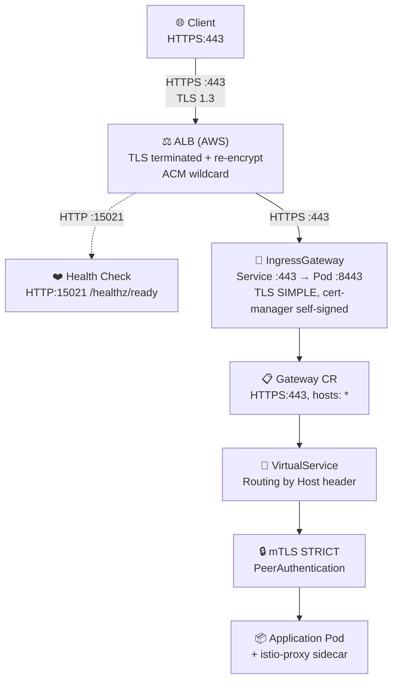

🔒 **Istio Service Mesh on EKS: A Field Report on mTLS and Zero Trust Implementation**

New assignment, new context, new challenges.

If you follow this blog, you know my background leans heavily toward **Access Management** — years spent implementing OIDC flows, SAML, operating authentication platforms in production within the banking sector, all with a strong Java development component and a growing Ops sensibility. That's what led me to write the previous articles on Quarkus, hexagonal architecture, and TRusTY.

And then came this new assignment. An **AWS** environment, **EKS** clusters, **FluxCD** for GitOps, and a clear security audit recommendation: **enable mTLS encryption on inter-service communications** through a service mesh. The subject? **Istio**. The challenge? Picking up the unfinished Istio mesh implementation, when all of this was completely new to me.

### **The context: when security meets infrastructure**

With my security profile and DevOps sensibility, I was naturally entrusted with continuing the Istio setup — work that had been started previously and needed to be picked up, completed, and brought to actual mesh activation with mTLS and Zero Trust, across **multiple clusters**. On paper, it made sense: who better than a security profile to understand the stakes of in-transit encryption, mutual authentication, and Zero Trust?

Except in reality, it's a different story. **AWS, EKS, Istio, Envoy, FluxCD** — technologies I was discovering all at once. And when you add the EKS abstraction layer on top of Kubernetes, which is itself quite an abstraction, all orchestrated by FluxCD with its reconciliation principle that overwrites your manual changes every 5 minutes... it gets **very abstract, very fast**.

### **Resourcefulness as the main weapon**

I won't lie: there were moments of doubt. Moments where you wonder if you'll make it, when the subject feels so far beyond your core skills. But that's precisely when you need to **not let go**. Understand each layer, one by one. Trace every error back to its root cause. Read the official documentation, GitHub issues, technical blogs. Test, fail, understand why, try again.

It took a good dose of **resourcefulness** to untangle the interactions between all these components: how the AWS ALB forwards traffic to the IngressGateway, why Envoy rejects certain connections, how FluxCD interacts with Kubernetes labels, why a self-signed certificate is enough on an internal segment... Every piece of the puzzle required patience and persistence.

**This article is the result of that journey** — an honest field report: the architecture we put in place, the configurations, the challenges encountered (and there were many!), and ultimately the satisfaction of seeing mTLS work end-to-end. As a bonus: a progressive migration plan with zero impact to activate Istio namespace by namespace.

## 🎯 **Why Istio? The field assessment**

### **The problem: plaintext communications within the cluster**

Without a service mesh, communications between Kubernetes pods travel **in plaintext** over the cluster's internal network. Sure, the network is isolated — but an attacker with internal network access (or a compromised pod) can intercept all exchanges. And when **security audits** explicitly flag this lack of in-transit encryption and application-level network segmentation, the issue becomes a priority.

That's exactly the context I walked into: the recommendation was clear, a service mesh was needed.

### **Why Istio over other solutions?**

Istio checked all the boxes — and as a security profile, certain points resonated particularly:

- **CNCF graduated project**: guaranteed maturity and longevity (same level as Kubernetes, Prometheus, Envoy)
- **Automatic mTLS**: end-to-end encryption **without modifying application code** — fundamental when you have dozens of services to secure
- **Native Zero Trust**: `AuthorizationPolicy` for fine-grained control of who can talk to whom — just like access policies in the IAM world, but at the network level
- **Observability**: distributed tracing, Envoy metrics, CloudWatch integration
- **Large community**: abundant documentation, numerous field reports

> **SPIFFE** (Secure Production Identity Framework For Everyone): a CNCF standard that assigns a unique cryptographic identity to each workload in the form of a URI — for example `spiffe://cluster.local/ns/my-app/sa/default`. This identity is embedded in mTLS certificates and enables mutual authentication between services. For an AM profile, it's the direct parallel to OIDC identities — except here, it's at the infrastructure level.

### **What Istio concretely brings**

| Security principle | Istio implementation |
|---|---|
| **In-transit encryption** | Automatic mTLS between all pods (TLS 1.3, SPIFFE certificates) |
| **Mutual authentication** | Each service proves its identity through its certificate — impossible to impersonate a service |
| **Least privilege access** | `AuthorizationPolicy`: deny-all by default, explicit ALLOW per service |
| **Microsegmentation** | `Sidecar` CR: each namespace only sees its own services |
| **Continuous monitoring** | Telemetry, OpenTelemetry distributed tracing |

## 🏗️ **The architecture: triple encryption layer**

### **Traffic flow overview**

The architecture ensures **encryption at every segment** of the traffic:



### **The three encryption layers**

| Segment | Protocol | Certificate | Management |
|---|---|---|---|
| Client → ALB | HTTPS (TLS 1.3) | ACM wildcard | AWS Certificate Manager, auto-renewal |
| ALB → IngressGateway | HTTPS (re-encrypt) | Self-signed ECDSA P-256 | cert-manager, 90-day rotation |
| IngressGateway → Pod | mTLS | Istio CA (SPIFFE identity) | Automatic rotation by Istio |

**Why three layers?** Each segment has its own certificate and its own rotation mechanism. If a certificate is compromised, only one segment is affected. This is **defense in depth**.

## ⚙️ **The components: detailed configuration**

### **1. ALB Ingress — AWS entry point**

The AWS Application Load Balancer receives external traffic and routes it to the Istio IngressGateway.

```yaml
apiVersion: networking.k8s.io/v1
kind: Ingress
metadata:
  name: istio-ingress
  namespace: istio-system
  annotations:
    alb.ingress.kubernetes.io/scheme: internal
    alb.ingress.kubernetes.io/ssl-policy: "ELBSecurityPolicy-TLS13-1-2-2021-06"
    alb.ingress.kubernetes.io/backend-protocol: "HTTPS"
    alb.ingress.kubernetes.io/healthcheck-path: "/healthz/ready"
    alb.ingress.kubernetes.io/healthcheck-port: "15021"
spec:
  ingressClassName: alb
  rules:
    - http:
        paths:
          - path: /
            pathType: Prefix
            backend:
              service:
                name: istio-ingressgateway
                port:
                  number: 443
```

Key points:
- **`backend-protocol: HTTPS`**: the ALB **re-encrypts** traffic to the backend (no plaintext between ALB and IngressGateway)
- **`ssl-policy: TLS13`**: TLS 1.3 minimum on the client side
- **Health check on port 15021**: Istio's dedicated health check port (separate from application traffic)

> **Field anecdote**: the AWS Load Balancer Controller uses an **auto-discovery** mechanism to find eligible subnets — and without the right tags, it refuses to create the ALB. It sounds simple put that way, but wait until you see what happens with **multiple clusters in the same VPC**... Details and gotchas in the [Challenge #4 — ALB Subnets](#4-alb-subnets--missing-tags) section.

### **2. TLS Certificate — cert-manager**

Certificate managed by cert-manager for the ALB → IngressGateway segment:

```yaml
apiVersion: cert-manager.io/v1
kind: ClusterIssuer
metadata:
  name: selfsigned-issuer
spec:
  selfSigned: {}
---
apiVersion: cert-manager.io/v1
kind: Certificate
metadata:
  name: istio-ingressgateway-cert
  namespace: istio-system
spec:
  secretName: istio-ingressgateway-tls
  duration: 2160h     # 90 days
  renewBefore: 720h   # Renewal 30 days before expiration
  privateKey:
    algorithm: ECDSA
    size: 256
  issuerRef:
    name: selfsigned-issuer
    kind: ClusterIssuer
  dnsNames:
    - "*.my-domain.example.com"
```

> Why a **self-signed** certificate? The AWS ALB doesn't validate the backend certificate when using `backend-protocol: HTTPS`. A self-signed cert is therefore sufficient to encrypt the ALB → IngressGateway segment. What matters is the encryption, not the certificate trust on this internal segment.

### **3. Shared Gateway — one for the entire mesh**

Instead of a Gateway CR per application (which multiplies Envoy listeners and complexity), a **single shared Gateway** in `istio-system`:

```yaml
apiVersion: networking.istio.io/v1
kind: Gateway
metadata:
  name: istio-shared-gateway
  namespace: istio-system
spec:
  selector:
    istio: ingressgateway
  servers:
    - port:
        number: 443
        name: https
        protocol: HTTPS
      tls:
        mode: SIMPLE
        credentialName: istio-ingressgateway-tls
      hosts:
        - "*"
```

> **Important note**: `hosts: ["*"]` is **mandatory** — the AWS ALB doesn't send SNI in HTTPS backend mode, which causes 502s if specific hosts are specified. Details in [Challenge #3 — ALB without SNI](#3-alb-without-sni--the-502-trap).

### **4. VirtualService — per-application routing**

Each application declares its VirtualService referencing the shared Gateway:

```yaml
apiVersion: networking.istio.io/v1
kind: VirtualService
metadata:
  name: my-app-vs
  namespace: my-app
spec:
  hosts:
    - "my-app.my-domain.example.com"
  gateways:
    - istio-system/istio-shared-gateway
  http:
    - match:
        - uri:
            prefix: /
      route:
        - destination:
            host: my-app-service
            port:
              number: 8080
```

### **5. PeerAuthentication — mTLS STRICT**

The heart of inter-service encryption:

```yaml
apiVersion: security.istio.io/v1
kind: PeerAuthentication
metadata:
  name: default
  namespace: istio-system    # Mesh-wide scope
spec:
  mtls:
    mode: STRICT
```

Applied in `istio-system`, this is a **mesh-wide** rule: **all** inter-service traffic must use mTLS. A pod without an Istio sidecar is simply **rejected**.

### **6. DestinationRule — Defense in depth**

Complementary to PeerAuthentication, the DestinationRule enforces mTLS on the **client** (sender) side:

```yaml
apiVersion: networking.istio.io/v1
kind: DestinationRule
metadata:
  name: default
  namespace: istio-system
spec:
  host: "*.local"
  trafficPolicy:
    tls:
      mode: ISTIO_MUTUAL
```

### **7. AuthorizationPolicy — Zero Trust**

This is the key component of **Zero Trust**. Three policies per namespace:

```yaml
# 1. Deny-all — EVERYTHING is forbidden by default
apiVersion: security.istio.io/v1
kind: AuthorizationPolicy
metadata:
  name: deny-all
  namespace: my-app
spec: {}
---
# 2. Only allow traffic from the IngressGateway
apiVersion: security.istio.io/v1
kind: AuthorizationPolicy
metadata:
  name: allow-ingress-gateway
  namespace: my-app
spec:
  action: ALLOW
  rules:
    - from:
        - source:
            principals:
              - "cluster.local/ns/istio-system/sa/istio-ingressgateway-service-account"
---
# 3. Allow Kubernetes health checks
apiVersion: security.istio.io/v1
kind: AuthorizationPolicy
metadata:
  name: allow-health-checks
  namespace: my-app
spec:
  action: ALLOW
  rules:
    - to:
        - operation:
            paths: ["/healthz", "/readyz", "/livez", "/health", "/ready"]
```

**Principle**: a pod can only receive traffic from the IngressGateway or through health checks. A compromised pod in one namespace cannot reach pods in another namespace.

### **8. Sidecar CR — Network microsegmentation**

Restricts network visibility for each Envoy proxy:

```yaml
apiVersion: networking.istio.io/v1
kind: Sidecar
metadata:
  name: default
  namespace: my-app
spec:
  egress:
    - hosts:
        - "istio-system/*"    # Istio control plane
        - "kube-system/*"     # DNS
        - "./*"               # Same namespace only
  outboundTrafficPolicy:
    mode: REGISTRY_ONLY       # Block all traffic to unknown services
```

> `REGISTRY_ONLY`: if a service isn't in the Istio registry, outbound traffic is blocked. This prevents connections to undeclared services — a compromised pod cannot exfiltrate data to an arbitrary external endpoint.

### **9. Telemetry — Distributed tracing**

```yaml
apiVersion: telemetry.istio.io/v1
kind: Telemetry
metadata:
  name: mesh-default
  namespace: istio-system
spec:
  tracing:
    - providers:
        - name: opentelemetry
      customTags:
        cluster_name:
          environment:
            name: CLUSTER_NAME
        env:
          environment:
            name: ENVIRONMENT
```

Distributed tracing via OpenTelemetry, with export to CloudWatch. Custom tags for filtering by namespace, service, cluster, and environment.

## 🔥 **Challenges encountered (and solved!)**

This is the part I most wanted to share — because this is where the real value of a field report lies. Official documentation explains how to configure Istio in an ideal world. But nobody warns you about what happens when the AWS ALB doesn't behave as expected, when FluxCD overwrites your changes, or when an "innocent" DestinationRule silently breaks all your mTLS.

Every problem below cost me hours of debugging — and taught me something fundamental about the inner workings of Istio and EKS. If it can save you even one of those hours...

### **1. Injection label: legacy vs revision-based**

**Symptom**: After adding the `istio-injection=enabled` label to a namespace, pods remain at 1/1 (no sidecar injected).

**Cause**: The cluster used Istio's **revision-based** mode. The legacy label `istio-injection=enabled` doesn't work in this configuration.

**Solution**:
```bash
# Use the revision-based label
kubectl label namespace my-app istio.io/rev=default --overwrite

# If the legacy label is present, remove it (it takes priority and blocks)
kubectl label namespace my-app istio-injection-
```

**Bonus trap**: our GitOps tool overwrote the label at every reconciliation (~5 min) because the namespace in Git didn't contain this label. Permanent fix: add the label to the namespace YAML in the Git repo.

> **Lesson**: always check the cluster's injection mode (`istioctl version`) before configuring labels. And make sure labels are managed in the Git repo if a GitOps tool is in place.

### **2. Helm chart / Istio version incompatibility**

**Symptom**: Pods remain at 1/1 despite the correct label. In istiod logs:
```
can't evaluate field NativeSidecars in type *inject.SidecarTemplateData
```

**Cause**: The `istio-sidecar-injector` ConfigMap had been generated from a Helm chart adapted for Istio 1.25, while the cluster was running Istio 1.24.3. The `NativeSidecars` field doesn't exist in this version.

**Temporary solution**: Replace `(printf "%t" .NativeSidecars)` with `("false")` in the ConfigMap.

**Permanent solution**: Align the Helm chart with the exact deployed Istio version.

> **Lesson**: Istio Helm charts are not backward-compatible between minor versions. Always verify the chart ↔ istiod version match.

### **3. ALB without SNI — the 502 trap**

**Symptom**: HTTP 502 Bad Gateway on all requests going through the ALB, while direct curl to the IngressGateway worked fine.

**Cause**: The AWS ALB, when using `backend-protocol: HTTPS`, sends a TLS ClientHello **without the SNI extension**. If the Gateway CR specifies specific hosts, Envoy creates `filter_chain_match.server_names` and rejects the connection because no SNI matches.

**Solution**: `hosts: ["*"]` on the Gateway CR. Hostname-based routing is handled by VirtualServices via the HTTP `Host` header.

> **Lesson**: the AWS ALB's behavior in HTTPS backend mode isn't clearly documented. This is a classic that traps many people. Always test the complete ALB → backend flow, not just the backend alone.

### **4. ALB Subnets — missing tags**

**Symptom**: The ALB isn't created, the controller displays `Failed build model`.

**Cause**: The AWS Load Balancer Controller uses an **auto-discovery** mechanism to find eligible subnets. Without the right tags, it finds no subnet and refuses to create the ALB. The error message is explicit, but you still need to understand **why** the subnets aren't found — you end up inspecting AWS tags and reading the controller docs to discover this prerequisite.

**Solution**:

| ALB type | Required tag |
|---|---|
| **Internal** | `kubernetes.io/role/internal-elb` = `1` |
| **Public** | `kubernetes.io/role/elb` = `1` |

```bash
# Check existing tags
aws ec2 describe-subnets --filters "Name=vpc-id,Values=<VPC_ID>" \
  --query "Subnets[*].[SubnetId,Tags]" --output table

# Add tag if missing
aws ec2 create-tags --resources <SUBNET_ID> \
  --tags Key=kubernetes.io/role/internal-elb,Value=1
```

**But the real trap comes next.** On the lab environment — a single cluster per VPC — everything works on the first try. Except the subsequent environments (dev, staging, etc.) host **multiple clusters in a shared VPC**. And then nothing works. You also need the `kubernetes.io/cluster/<CLUSTER_NAME>` = `shared` tag on each subnet, otherwise one cluster's controller can interfere with the other.

```bash
# Additional tag required in multi-cluster VPC
aws ec2 create-tags --resources <SUBNET_ID> \
  --tags Key=kubernetes.io/cluster/<CLUSTER_NAME>,Value=shared
```

The kind of detail you can't make up: it works perfectly on the first environment, and silently breaks on the next ones.

> **Lesson**: in multi-cluster VPCs, always check both tags. The `kubernetes.io/role/*-elb` tag alone isn't enough — you also need to identify which cluster "owns" which subnets via `kubernetes.io/cluster/<NAME>`.

### **5. Application DestinationRule without mTLS — the silent 502**

**Symptom**: `curl` from the IngressGateway returns exit code 56 (connection reset by peer). No explicit error in the logs.

**Cause**: An existing application DestinationRule (for sticky sessions) defined a `trafficPolicy` with `consistentHash` but **omitted** `tls.mode: ISTIO_MUTUAL`. However, a specific DestinationRule **completely replaces** the mesh-wide DestinationRule. The IngressGateway was sending plaintext traffic to a sidecar in mTLS STRICT → rejected.

**Solution**: Every application DestinationRule **must** include the `tls` section:
```yaml
spec:
  host: my-service
  trafficPolicy:
    tls:
      mode: ISTIO_MUTUAL     # MANDATORY if PeerAuthentication is STRICT
    loadBalancer:
      consistentHash:
        httpCookie:
          name: x-sticky
          path: /
          ttl: 20s
```

> **Lesson**: this is probably the most treacherous Istio gotcha. A specific DestinationRule **overrides** the global DestinationRule, including the mTLS configuration. This must be documented and systematically checked during migration.

### **6. Corporate proxy — inaccessible images**

**Symptom**: `ErrImagePull` on Istio pods, with error `x509: certificate signed by unknown authority`.

**Cause**: The corporate proxy performs TLS interception and replaces public registry certificates (quay.io, ghcr.io) with a certificate signed by the internal CA.

**Solution**: Copy images to the private registry (ECR) and use an override in the installation script.

> **Lesson**: in corporate environments, always plan for image mirroring to a private registry. Never depend on public registries in production.

### **7. Distroless images — no shell for debugging**

**Symptom**: Unable to `kubectl exec` with `curl` into istiod or istio-proxy pods.

**Cause**: Istio uses distroless images (no shell or tools) for security reasons.

**Solution**: Use `istioctl` to inspect the configuration:
```bash
# Inspect Envoy config by aspect
istioctl proxy-config routes <pod> -n <namespace>
istioctl proxy-config clusters <pod> -n <namespace>
istioctl proxy-config listeners <pod> -n <namespace>

# The game-changer: consolidated view
istioctl x describe pod <pod-name> -n <namespace>
```

The real gem here is `istioctl x describe pod`. Where `proxy-config` commands give you a raw, technical view (Envoy routes, listeners, clusters), **`describe` analyzes the pod and consolidates everything** into a single readable output:

- **Services** associated with the pod and their ports
- **DestinationRules** that match (with the effective TLS mode)
- **VirtualServices** routing to this pod
- The effective **PeerAuthentication** (STRICT, PERMISSIVE...)
- Exposure through the **IngressGateway**
- And most importantly: **warnings** for misconfigurations (DestinationRule without mTLS, VirtualService that never routes to a subset, etc.)

This is exactly what you need when debugging a 502 and you don't know which Istio policy is actually being applied. In a single command, you see the entire chain.

> **Fun fact**: this command has been under the `x` (experimental) prefix **since its introduction in 2019** — over 6 years. It has never "graduated" to a stable command, which gives it a hidden gem vibe. Yet it's [officially documented](https://istio.io/latest/docs/ops/diagnostic-tools/istioctl-describe/) and is probably the most useful debugging tool in the entire Istio ecosystem. `istioctl` is your best friend — and `x describe` is its killer feature.

## 📋 **The migration plan: progressive with zero impact**

Once the architecture was validated on the lab and all the gotchas identified, the most critical question remained: **how to deploy this on production clusters without breaking anything?** The beauty of Istio is that it allows **progressive, reversible activation, without ever impacting existing traffic flows**.

### **Key principles**

1. **Namespace by namespace**: never a big-bang, we activate Istio one namespace at a time
2. **PERMISSIVE first**: start by accepting mTLS **and** plaintext traffic (coexistence)
3. **STRICT afterwards**: once all namespaces are migrated, enforce mTLS
4. **Rollback in minutes**: switch back to PERMISSIVE to unblock, or remove the label as a last resort

### **The phases**

```mermaid
gantt
    title Istio Migration Plan
    dateFormat X
    axisFormat S+%s
    tickInterval 1second

    section Infrastructure
    Merge Istio configs, Gateway, ALB HTTPS              :s0, 0, 1s

    section Pilot
    1 app - VirtualService, Sidecar CR, AuthzPolicy       :s1, after s0, 1s

    section Wave 1
    Similar apps - migrate one by one                      :s2, after s1, 1s

    section Wave 2
    Other app types - adapt and migrate                    :s3, after s2, 1s

    section STRICT Switch
    PERMISSIVE to STRICT, 24h monitoring                   :crit, s4, after s3, 1s

    section Other envs
    Lab, Dev, Staging, Preprod, Prod                        :s5, after s4, 8s
```



#### **S+0 — Cluster infrastructure**
- Merge Istio configs (PeerAuthentication in PERMISSIVE mode)
- Deploy the shared Gateway + cert-manager certificate + ALB HTTPS
- Validate the GitOps deployment (FluxCD reconciliation OK)

#### **S+1 — Pilot (1 app)**
- Migrate the VirtualService to the shared gateway
- Add Sidecar CR + AuthorizationPolicy
- Functional validation over 3-5 days

#### **S+2 — Wave 1 (similar apps)**
- Migrate applications one by one (not in parallel)
- Progressive cleanup of centralized configs
- Verify proper functioning after each migration

#### **S+3 — Wave 2 (other app types)**
- Adapt the pattern if necessary (e.g., apps with existing DestinationRules)
- Migrate and clean up — same procedure as Wave 1

#### **S+4 — STRICT switch**
- Verify that **ALL** namespaces are migrated
- Switch PeerAuthentication from PERMISSIVE to STRICT
- Monitor for 24h (Envoy metrics, logs, alerts)

#### **S+5 → S+12 — Other environments**
- Deploy the same plan: Lab ✓ → Dev → Staging → Preprod → Prod
- Validation gate between each environment
- Same plan applied to each cluster

### **Per-namespace procedure**

For each application, the migration boils down to a **PR in the application repo**:

| File | Action |
|---|---|
| `virtual-service.yaml` | Modify: `gateways: [istio-system/istio-shared-gateway]` |
| `istio-sidecar.yaml` | Add: network visibility restriction |
| `istio-authorizationpolicy.yaml` | Add: deny-all + allow ingress + allow health checks |
| `istio-destinationrule.yaml` | Add: `tls.mode: ISTIO_MUTUAL` (+ sticky session if needed) |
| `kustomization.yaml` | Modify: reference the new files |

### **Rollback**

In case of issues, two rollback levels:

**Level 1 — Switch back to PERMISSIVE** (first response):
```bash
# Immediately unblock by accepting mTLS AND plaintext traffic
kubectl patch peerauthentication default -n istio-system \
  --type='merge' -p='{"spec":{"mtls":{"mode":"PERMISSIVE"}}}'
```
Traffic resumes instantly — pods with sidecars continue using mTLS, others switch to plaintext. No restart needed.

**Level 2 — Exit the mesh** (last resort):
```bash
# 1. Remove the injection label
kubectl label namespace my-app istio.io/rev-

# 2. Restart pods (the sidecar will be removed)
kubectl rollout restart deployment -n my-app
```

## 🔍 **Verification: proving the mesh works**

### **Validation tests**

A few essential commands to validate proper functioning:

```bash
# 1. Verify sidecar injection (2/2 READY)
kubectl get pods -n my-app
# NAME                          READY   STATUS    RESTARTS   AGE
# my-app-7b8d4f5c6d-abc12      2/2     Running   0          5m

# 2. Check mTLS status
istioctl x describe pod my-app-7b8d4f5c6d-abc12 -n my-app
# → mTLS enabled, PeerAuthentication STRICT

# 3. End-to-end HTTPS flow test
curl -skI https://my-app.my-domain.example.com/
# → HTTP/2 200

# 4. Proof that mTLS is enforced (plaintext traffic rejected)
kubectl exec -n istio-system deploy/istio-ingressgateway -c istio-proxy -- \
  curl -sI http://my-app-service.my-app.svc.cluster.local:8080/ 2>&1
# → Connection reset (exit code 56) — mTLS STRICT rejects plaintext ✅
```

### **The ultimate proof**

Test 4 is the most convincing proof: a plaintext HTTP call to a protected service is **rejected**. mTLS is truly enforced, not optional.

## 🎉 **Conclusion: stepping out of your comfort zone pays off**

The moment I saw the first **HTTP 200** traverse all three encryption layers — Client → ALB → IngressGateway → Pod — after countless 502s, it was first and foremost an immense **relief**. The relief of having made it through the tunnel, of finally seeing traffic flow where there had been nothing but errors for days. And when the plaintext test confirmed the rejection (exit code 56), it was the cherry on top: mTLS is truly enforced, no compromises.

When I started this assignment, I had a vague knowledge of AWS, EKS. I was an AM expert and Java developer, with a growing Ops component. Today, I can say that my **Ops component has taken a significant leap** — and that's exactly what I was looking for when I took on this challenge. AWS, EKS, Istio, Envoy, FluxCD, cert-manager: technologies I now master well enough to implement in production, debug, and pass on best practices to the team.

**What I take away from this**:

- **A security background helps understand Istio**: my Access Management experience gave me valuable reflexes — Zero Trust, mutual authentication, identity management (SPIFFE ≈ OIDC at the infrastructure level), it's a vocabulary I already mastered. It helped me understand the "why" of Istio faster than the "how."
- **Resourcefulness matters more than expertise**: you don't need to know everything upfront. What you need is the ability to trace every problem back to its root cause, to read logs, to understand component interactions. The rest, you learn in the field.
- **Istio is powerful but demanding**: the learning curve is real, the pitfalls are many (DestinationRule overriding mTLS, ALB without SNI, FluxCD overwriting your labels...). But once mastered, it's a remarkable tool.
- **Progressive migration is key**: PERMISSIVE mode allows a smooth coexistence between pods with and without sidecars. Never a big-bang.
- **Document every gotcha**: the problems encountered (and their solutions) become a valuable knowledge base for the team. That's one of the reasons for this article.

Zero Trust on Kubernetes is no longer a theoretical concept — it's an operational reality, namespace by namespace, with a rollback in minutes if needed. And for me, it's also proof that you can significantly expand your skill set when you don't give up.

**Questions? A similar field report?** Feel free to comment below or reach out. If you're in the same situation — a dev/security profile finding yourself doing Kubernetes infrastructure — I'd be curious to exchange about your own struggles and victories.

## 🛠️ **Reference implementation**

To go beyond theory, I've published two Terraform modules that concretely implement everything described in this article:

- **[terraform-istio](https://github.com/lostyzen/terraform-istio)** — Complete infrastructure: VPC, EKS, Istio 1.24.2, cert-manager, ALB HTTPS, PeerAuthentication STRICT, DestinationRule, AuthorizationPolicy, Sidecar, Telemetry. The triple end-to-end encryption, ready to deploy.
- **[terraform-quarkus](https://github.com/lostyzen/terraform-quarkus)** — Deployment of a [Quarkus](https://github.com/lostyzen/quarkus-demo-basic-api) application (hexagonal architecture) on the Istio mesh, with sidecar injection, VirtualService, and Zero Trust AuthorizationPolicy.

Both modules are tested and functional on an EKS sandbox cluster.

## 🔗 **Useful resources**

### **Official documentation**
- [Istio Documentation](https://istio.io/latest/docs/)
- [SPIFFE - Secure Production Identity Framework](https://spiffe.io/)
- [Envoy Proxy Documentation](https://www.envoyproxy.io/docs)

### **Specifications and standards**
- [CNCF Graduated Projects](https://www.cncf.io/projects/)
- [Kubernetes Network Policies](https://kubernetes.io/docs/concepts/services-networking/network-policies/)
- [cert-manager Documentation](https://cert-manager.io/docs/)

### **AWS EKS**
- [AWS Load Balancer Controller](https://kubernetes-sigs.github.io/aws-load-balancer-controller/)
- [Amazon EKS Best Practices - Security](https://docs.aws.amazon.com/eks/latest/best-practices/security.html)
- [IRSA - IAM Roles for Service Accounts](https://docs.aws.amazon.com/eks/latest/userguide/iam-roles-for-service-accounts.html)
