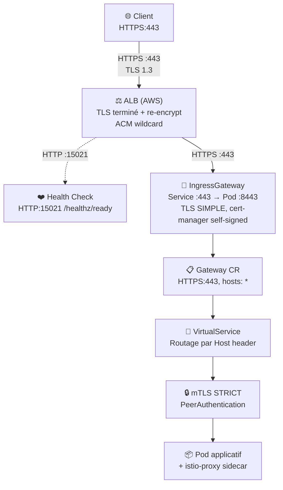

🔒 **Istio Service Mesh sur EKS : Retour d'expérience sur la mise en place du mTLS et du Zero Trust**

Nouvelle mission, nouveau contexte, nouveaux défis.

Si vous suivez ce blog, vous savez que mon parcours est plutôt orienté **Access Management** — des années passées à implémenter des flux OIDC, du SAML, à opérer des plateformes d'authentification en production dans le secteur bancaire, le tout avec une composante dev Java assez forte et une sensibilité Ops qui grandit au fil des missions. C'est d'ailleurs ce qui m'a poussé à écrire les articles précédents sur Quarkus, l'architecture hexagonale, ou encore TRusTY.

Et puis il y a eu cette nouvelle mission. Un environnement **AWS**, des clusters **EKS**, du **FluxCD** pour le GitOps, et une recommandation d'audit de sécurité claire : **activer le chiffrement mTLS sur les communications inter-services** via un service mesh. Le sujet ? **Istio**. Le challenge ? Continuer l'implémentation non terminée du mesh Istio, alors que tout ceci est totalement nouveau pour moi.

### **Le contexte : quand la sécu rencontre l'infra**

Avec mon profil sécurité et ma sensibilité DevOps, on m'a naturellement confié la suite de la mise en place d'Istio — un travail initié précédemment qu'il fallait reprendre, compléter et amener jusqu'à l'activation réelle du mesh avec mTLS et Zero Trust, et ce pour **plusieurs clusters**. Sur le papier, ça avait du sens : qui mieux qu'un profil sécu pour comprendre les enjeux du chiffrement en transit, de l'authentification mutuelle et du Zero Trust ?

Sauf que dans la réalité, c'est une autre histoire. **AWS, EKS, Istio, Envoy, FluxCD** — autant de technologies que je découvrais en même temps. Et quand on ajoute la couche d'abstraction d'EKS par-dessus Kubernetes, qui lui-même est déjà une belle abstraction, le tout orchestré par FluxCD avec son principe de réconciliation qui écrase vos modifications manuelles toutes les 5 minutes... ça devient **très abstrait, très vite**.

### **La perspicacité comme arme principale**

Je ne vais pas mentir : il y a eu des moments de doute. Des moments où on se demande si on va y arriver, tellement le sujet semble hors de portée de ses compétences de base. Mais c'est justement dans ces moments qu'il faut **ne pas lâcher le morceau**. Comprendre chaque couche, une par une. Remonter chaque erreur jusqu'à sa cause racine. Lire la documentation officielle, les issues GitHub, les blogs techniques. Tester, échouer, comprendre pourquoi, recommencer.

Il m'a fallu une bonne dose de **perspicacité** pour démêler les interactions entre tous ces composants : comment l'ALB AWS transmet le trafic à l'IngressGateway, pourquoi Envoy rejette certaines connexions, comment FluxCD interagit avec les labels Kubernetes, pourquoi un certificat self-signed suffit sur un segment interne... Chaque pièce du puzzle a demandé de la patience et de l'obstination.

**Cet article est le fruit de ce parcours** — un retour d'expérience honnête : l'architecture mise en place, les configurations, les difficultés rencontrées (et il y en a eu !), et finalement la satisfaction de voir le mTLS fonctionner de bout en bout. En bonus : un plan de migration progressif et sans impact pour activer Istio namespace par namespace.

## 🎯 **Pourquoi Istio ? Le constat terrain**

### **Le problème : des communications en clair dans le cluster**

Sans service mesh, les communications entre pods Kubernetes transitent **en clair** sur le réseau interne du cluster. Certes, le réseau est isolé — mais un attaquant ayant accès au réseau interne (ou un pod compromis) peut intercepter tous les échanges. Et quand des **audits de sécurité** pointent explicitement ce manque de chiffrement en transit et de segmentation réseau au niveau applicatif, le sujet devient prioritaire.

C'est exactement le contexte dans lequel je suis arrivé : la recommandation était claire, il fallait un service mesh.

### **Pourquoi Istio plutôt qu'une autre solution ?**

Istio cochait toutes les cases — et en tant que profil sécurité, certains points résonnaient particulièrement :

- **Projet graduated CNCF** : maturité et pérennité garanties (au même niveau que Kubernetes, Prometheus, Envoy)
- **mTLS automatique** : chiffrement de bout en bout **sans modifier le code applicatif** — fondamental quand on a des dizaines de services à sécuriser
- **Zero Trust natif** : `AuthorizationPolicy` pour contrôler finement qui peut parler à qui — exactement comme les politiques d'accès dans le monde IAM, mais au niveau réseau
- **Observabilité** : tracing distribué, métriques Envoy, intégration CloudWatch
- **Large communauté** : documentation abondante, retours d'expérience nombreux

> **SPIFFE** (Secure Production Identity Framework For Everyone) : standard CNCF qui attribue une identité cryptographique unique à chaque workload sous la forme d'un URI — par exemple `spiffe://cluster.local/ns/my-app/sa/default`. C'est cette identité qui est embarquée dans les certificats mTLS et qui permet l'authentification mutuelle entre services. Pour un profil AM, c'est le parallèle direct avec les identités OIDC — sauf qu'ici, c'est au niveau infrastructure.

### **Ce qu'Istio apporte concrètement**

| Principe de sécurité | Implémentation Istio |
|---|---|
| **Chiffrement en transit** | mTLS automatique entre tous les pods (TLS 1.3, certificats SPIFFE) |
| **Authentification mutuelle** | Chaque service prouve son identité via son certificat — impossible d'usurper un service |
| **Accès au moindre privilège** | `AuthorizationPolicy` : deny-all par défaut, ALLOW explicite par service |
| **Microsegmentation** | `Sidecar` CR : chaque namespace ne voit que ses propres services |
| **Supervision continue** | Télémétrie, tracing distribué OpenTelemetry |

## 🏗️ **L'architecture : triple couche de chiffrement**

### **Vue d'ensemble du flux**

L'architecture mise en place garantit un **chiffrement à chaque segment** du trafic :



### **Les trois couches de chiffrement**

| Segment | Protocole | Certificat | Gestion |
|---|---|---|---|
| Client → ALB | HTTPS (TLS 1.3) | ACM wildcard | AWS Certificate Manager, renouvellement auto |
| ALB → IngressGateway | HTTPS (re-encrypt) | Self-signed ECDSA P-256 | cert-manager, rotation 90 jours |
| IngressGateway → Pod | mTLS | Istio CA (identité SPIFFE) | Rotation automatique par Istio |

**Pourquoi trois couches ?** Chaque segment a son propre certificat et son propre mécanisme de rotation. Si un certificat est compromis, seul un segment est affecté. C'est de la **défense en profondeur**.

## ⚙️ **Les composants : configuration détaillée**

### **1. ALB Ingress — Point d'entrée AWS**

L'AWS Application Load Balancer reçoit le trafic externe et le route vers l'IngressGateway Istio.

```yaml
apiVersion: networking.k8s.io/v1
kind: Ingress
metadata:
  name: istio-ingress
  namespace: istio-system
  annotations:
    alb.ingress.kubernetes.io/scheme: internal
    alb.ingress.kubernetes.io/ssl-policy: "ELBSecurityPolicy-TLS13-1-2-2021-06"
    alb.ingress.kubernetes.io/backend-protocol: "HTTPS"
    alb.ingress.kubernetes.io/healthcheck-path: "/healthz/ready"
    alb.ingress.kubernetes.io/healthcheck-port: "15021"
spec:
  ingressClassName: alb
  rules:
    - http:
        paths:
          - path: /
            pathType: Prefix
            backend:
              service:
                name: istio-ingressgateway
                port:
                  number: 443
```

Points clés :
- **`backend-protocol: HTTPS`** : l'ALB **re-chiffre** le trafic vers le backend (pas de plaintext entre l'ALB et l'IngressGateway)
- **`ssl-policy: TLS13`** : TLS 1.3 minimum côté client
- **Health check sur le port 15021** : port dédié d'Istio pour les health checks (séparé du trafic applicatif)

> **Anecdote terrain** : l'AWS Load Balancer Controller utilise un mécanisme d'**auto-discovery** pour trouver les subnets éligibles — et sans les bons tags, il refuse de créer l'ALB. Ça a l'air simple dit comme ça, mais attendez de voir ce qui se passe avec **plusieurs clusters dans un même VPC**... Les détails et les pièges sont dans la section [Difficulté #4 — Subnets ALB](#4-subnets-alb--tags-manquants).

### **2. Certificat TLS — cert-manager**

Certificat géré par cert-manager pour le segment ALB → IngressGateway :

```yaml
apiVersion: cert-manager.io/v1
kind: ClusterIssuer
metadata:
  name: selfsigned-issuer
spec:
  selfSigned: {}
---
apiVersion: cert-manager.io/v1
kind: Certificate
metadata:
  name: istio-ingressgateway-cert
  namespace: istio-system
spec:
  secretName: istio-ingressgateway-tls
  duration: 2160h     # 90 jours
  renewBefore: 720h   # Renouvellement 30 jours avant expiration
  privateKey:
    algorithm: ECDSA
    size: 256
  issuerRef:
    name: selfsigned-issuer
    kind: ClusterIssuer
  dnsNames:
    - "*.my-domain.example.com"
```

> Pourquoi un certificat **self-signed** ? L'ALB AWS ne valide pas le certificat backend lorsqu'il utilise `backend-protocol: HTTPS`. Un cert self-signed suffit donc pour chiffrer le segment ALB → IngressGateway. L'important est le chiffrement, pas la confiance du certificat sur ce segment interne.

### **3. Gateway partagée — une seule pour tout le mesh**

Au lieu d'une Gateway CR par application (ce qui multiplie les listeners Envoy et la complexité), une **seule Gateway partagée** dans `istio-system` :

```yaml
apiVersion: networking.istio.io/v1
kind: Gateway
metadata:
  name: istio-shared-gateway
  namespace: istio-system
spec:
  selector:
    istio: ingressgateway
  servers:
    - port:
        number: 443
        name: https
        protocol: HTTPS
      tls:
        mode: SIMPLE
        credentialName: istio-ingressgateway-tls
      hosts:
        - "*"
```

> **Point important** : `hosts: ["*"]` est **obligatoire** — l'ALB AWS n'envoie pas de SNI en mode HTTPS backend, ce qui provoque des 502 si on spécifie des hosts précis. Les détails dans [Difficulté #3 — ALB sans SNI](#3-alb-sans-sni--le-piège-du-502).

### **4. VirtualService — routage par application**

Chaque application déclare son VirtualService qui référence la Gateway partagée :

```yaml
apiVersion: networking.istio.io/v1
kind: VirtualService
metadata:
  name: my-app-vs
  namespace: my-app
spec:
  hosts:
    - "my-app.my-domain.example.com"
  gateways:
    - istio-system/istio-shared-gateway
  http:
    - match:
        - uri:
            prefix: /
      route:
        - destination:
            host: my-app-service
            port:
              number: 8080
```

### **5. PeerAuthentication — mTLS STRICT**

Le cœur du chiffrement inter-services :

```yaml
apiVersion: security.istio.io/v1
kind: PeerAuthentication
metadata:
  name: default
  namespace: istio-system    # Portée mesh-wide
spec:
  mtls:
    mode: STRICT
```

Appliqué dans `istio-system`, c'est une règle **mesh-wide** : **tout** trafic inter-services doit être en mTLS. Un pod sans sidecar Istio est tout simplement **rejeté**.

### **6. DestinationRule — Défense en profondeur**

Complémentaire au PeerAuthentication, la DestinationRule impose côté **client** (émetteur) d'utiliser mTLS :

```yaml
apiVersion: networking.istio.io/v1
kind: DestinationRule
metadata:
  name: default
  namespace: istio-system
spec:
  host: "*.local"
  trafficPolicy:
    tls:
      mode: ISTIO_MUTUAL
```

### **7. AuthorizationPolicy — Zero Trust**

C'est le composant clé du **Zero Trust**. Trois policies par namespace :

```yaml
# 1. Deny-all — TOUT est interdit par défaut
apiVersion: security.istio.io/v1
kind: AuthorizationPolicy
metadata:
  name: deny-all
  namespace: my-app
spec: {}
---
# 2. Autorise uniquement le trafic depuis l'IngressGateway
apiVersion: security.istio.io/v1
kind: AuthorizationPolicy
metadata:
  name: allow-ingress-gateway
  namespace: my-app
spec:
  action: ALLOW
  rules:
    - from:
        - source:
            principals:
              - "cluster.local/ns/istio-system/sa/istio-ingressgateway-service-account"
---
# 3. Autorise les health checks Kubernetes
apiVersion: security.istio.io/v1
kind: AuthorizationPolicy
metadata:
  name: allow-health-checks
  namespace: my-app
spec:
  action: ALLOW
  rules:
    - to:
        - operation:
            paths: ["/healthz", "/readyz", "/livez", "/health", "/ready"]
```

**Principe** : un pod ne peut recevoir du trafic que de l'IngressGateway ou via les health checks. Un pod compromis dans un namespace ne peut pas atteindre les pods d'un autre namespace.

### **8. Sidecar CR — Microsegmentation réseau**

Restreint la visibilité réseau de chaque proxy Envoy :

```yaml
apiVersion: networking.istio.io/v1
kind: Sidecar
metadata:
  name: default
  namespace: my-app
spec:
  egress:
    - hosts:
        - "istio-system/*"    # Control plane Istio
        - "kube-system/*"     # DNS
        - "./*"               # Même namespace uniquement
  outboundTrafficPolicy:
    mode: REGISTRY_ONLY       # Bloque tout trafic vers des services inconnus
```

> `REGISTRY_ONLY` : si un service n'est pas dans le registry d'Istio, le trafic sortant est bloqué. Cela empêche les connexions vers des services non déclarés — un pod compromis ne peut pas exfiltrer de données vers un endpoint externe arbitraire.

### **9. Télémétrie — Tracing distribué**

```yaml
apiVersion: telemetry.istio.io/v1
kind: Telemetry
metadata:
  name: mesh-default
  namespace: istio-system
spec:
  tracing:
    - providers:
        - name: opentelemetry
      customTags:
        cluster_name:
          environment:
            name: CLUSTER_NAME
        env:
          environment:
            name: ENVIRONMENT
```

Tracing distribué via OpenTelemetry, avec export vers CloudWatch. Tags personnalisés pour filtrer par namespace, service, cluster et environnement.

## 🔥 **Les difficultés rencontrées (et résolues !)**

C'est la partie que je voulais le plus partager — parce que c'est là que se situe la vraie valeur d'un retour d'expérience. La documentation officielle vous explique comment configurer Istio dans un monde idéal. Mais personne ne vous prévient de ce qui se passe quand l'ALB AWS ne fait pas ce que vous attendez, quand FluxCD écrase vos modifications, ou quand une DestinationRule "innocente" casse silencieusement tout votre mTLS.

Chaque problème ci-dessous m'a coûté des heures de debug — et m'a appris quelque chose de fondamental sur le fonctionnement interne d'Istio et d'EKS. Si ça peut vous en épargner ne serait-ce qu'une...

### **1. Label d'injection : legacy vs revision-based**

**Symptôme** : Après ajout du label `istio-injection=enabled` sur un namespace, les pods restent à 1/1 (pas de sidecar injecté).

**Cause** : Le cluster utilisait le mode **revision-based** d'Istio. Le label legacy `istio-injection=enabled` ne fonctionne pas dans cette configuration.

**Solution** :
```bash
# Utiliser le label revision-based
kubectl label namespace my-app istio.io/rev=default --overwrite

# Si le label legacy est présent, le supprimer (il prend la priorité et bloque)
kubectl label namespace my-app istio-injection-
```

**Piège bonus** : notre outil GitOps écrasait le label à chaque réconciliation (~5 min) car le namespace dans Git ne contenait pas ce label. Fix permanent : ajouter le label dans le YAML du namespace dans le repo Git.

> **Leçon** : toujours vérifier le mode d'injection du cluster (`istioctl version`) avant de configurer les labels. Et s'assurer que les labels sont gérés dans le repo Git si un outil GitOps est en place.

### **2. Incompatibilité Helm chart / version Istio**

**Symptôme** : Les pods restent à 1/1 malgré le bon label. Dans les logs d'istiod :
```
can't evaluate field NativeSidecars in type *inject.SidecarTemplateData
```

**Cause** : Le ConfigMap `istio-sidecar-injector` avait été généré à partir d'un Helm chart adapté pour Istio 1.25, alors que le cluster tournait en Istio 1.24.3. Le champ `NativeSidecars` n'existe pas dans cette version.

**Solution temporaire** : Remplacement de `(printf "%t" .NativeSidecars)` par `("false")` dans le ConfigMap.

**Solution permanente** : Aligner le Helm chart avec la version exacte d'Istio déployée.

> **Leçon** : les Helm charts Istio ne sont pas rétrocompatibles entre versions mineures. Toujours vérifier la correspondance chart ↔ version istiod.

### **3. ALB sans SNI — le piège du 502**

**Symptôme** : HTTP 502 Bad Gateway sur toutes les requêtes passant par l'ALB, alors que le curl direct vers l'IngressGateway fonctionnait.

**Cause** : L'ALB AWS, lorsqu'il utilise `backend-protocol: HTTPS`, envoie un TLS ClientHello **sans extension SNI**. Si la Gateway CR spécifie des hosts précis, Envoy crée des `filter_chain_match.server_names` et rejette la connexion car aucun SNI ne correspond.

**Solution** : `hosts: ["*"]` sur la Gateway CR. Le routage par hostname est assuré par les VirtualServices via le header HTTP `Host`.

> **Leçon** : le comportement de l'ALB AWS en mode HTTPS backend n'est pas documenté clairement. C'est un classique qui piège beaucoup de monde. Toujours tester le flux complet ALB → backend, pas juste le backend seul.

### **4. Subnets ALB — tags manquants**

**Symptôme** : L'ALB n'est pas créé, le controller affiche `Failed build model`.

**Cause** : L'AWS Load Balancer Controller utilise un mécanisme d'**auto-discovery** pour trouver les subnets éligibles. Sans les bons tags, il ne trouve aucun subnet et refuse de créer l'ALB. Le message d'erreur est explicite, mais encore faut-il comprendre **pourquoi** les subnets ne sont pas trouvés — on finit par inspecter les tags AWS et lire la doc du controller pour découvrir ce prérequis.

**Solution** :

| Type d'ALB | Tag requis |
|---|---|
| **Interne** | `kubernetes.io/role/internal-elb` = `1` |
| **Public** | `kubernetes.io/role/elb` = `1` |

```bash
# Vérifier les tags existants
aws ec2 describe-subnets --filters "Name=vpc-id,Values=<VPC_ID>" \
  --query "Subnets[*].[SubnetId,Tags]" --output table

# Ajouter le tag si manquant
aws ec2 create-tags --resources <SUBNET_ID> \
  --tags Key=kubernetes.io/role/internal-elb,Value=1
```

**Mais le vrai piège arrive après.** Sur l'environnement de lab — un seul cluster par VPC — tout fonctionne du premier coup. Sauf que les environnements suivants (dev, rec, etc.) hébergent **plusieurs clusters dans un VPC commun**. Et là, rien ne marche. Il faut en plus le tag `kubernetes.io/cluster/<CLUSTER_NAME>` = `shared` sur chaque subnet, sinon le controller d'un cluster peut interférer avec celui de l'autre.

```bash
# Tag additionnel obligatoire en VPC multi-clusters
aws ec2 create-tags --resources <SUBNET_ID> \
  --tags Key=kubernetes.io/cluster/<CLUSTER_NAME>,Value=shared
```

Le genre de détail qui ne s'invente pas : ça fonctionne parfaitement sur le premier environnement, et ça casse silencieusement sur les suivants.

> **Leçon** : en VPC multi-clusters, toujours vérifier les deux tags. Le tag `kubernetes.io/role/*-elb` seul ne suffit pas — il faut aussi identifier quel cluster "possède" quels subnets via `kubernetes.io/cluster/<NAME>`.

### **5. DestinationRule applicative sans mTLS — le 502 silencieux**

**Symptôme** : `curl` depuis l'IngressGateway retourne exit code 56 (connection reset by peer). Pas d'erreur explicite dans les logs.

**Cause** : Une DestinationRule applicative existante (pour le sticky session) définissait un `trafficPolicy` avec `consistentHash` mais **omettait** `tls.mode: ISTIO_MUTUAL`. Or, une DestinationRule spécifique **remplace complètement** la DestinationRule mesh-wide. L'IngressGateway envoyait du trafic en clair vers un sidecar en mTLS STRICT → rejet.

**Solution** : Toute DestinationRule applicative **doit** inclure la section `tls` :
```yaml
spec:
  host: my-service
  trafficPolicy:
    tls:
      mode: ISTIO_MUTUAL     # OBLIGATOIRE si PeerAuthentication STRICT
    loadBalancer:
      consistentHash:
        httpCookie:
          name: x-sticky
          path: /
          ttl: 20s
```

> **Leçon** : c'est probablement le piège le plus vicieux d'Istio. Une DestinationRule spécifique **écrase** la DestinationRule globale, y compris la configuration mTLS. Ce point doit être documenté et vérifié systématiquement lors de la migration.

### **6. Proxy corporate — images non accessibles**

**Symptôme** : `ErrImagePull` sur les pods Istio, avec erreur `x509: certificate signed by unknown authority`.

**Cause** : Le proxy corporate effectue une interception TLS et remplace les certificats des registres publics (quay.io, ghcr.io) par un certificat signé par la CA interne.

**Solution** : Copier les images dans le registre privé (ECR) et utiliser un override dans le script d'installation.

> **Leçon** : en environnement corporate, toujours prévoir un mirroring des images dans un registre privé. Ne jamais dépendre des registres publics en production.

### **7. Images distroless — pas de shell pour debug**

**Symptôme** : Impossible de `kubectl exec` avec `curl` dans les pods istiod ou istio-proxy.

**Cause** : Istio utilise des images distroless (sans shell ni outils) pour des raisons de sécurité.

**Solution** : Utiliser `istioctl` pour inspecter la configuration :
```bash
# Inspecter la config Envoy par aspect
istioctl proxy-config routes <pod> -n <namespace>
istioctl proxy-config clusters <pod> -n <namespace>
istioctl proxy-config listeners <pod> -n <namespace>

# La commande qui change tout : vue consolidée
istioctl x describe pod <pod-name> -n <namespace>
```

La vraie pépite ici, c'est `istioctl x describe pod`. Là où les commandes `proxy-config` vous donnent une vue brute et technique (routes Envoy, listeners, clusters), **`describe` analyse le pod et consolide tout** en une seule sortie lisible :

- Les **Services** associés au pod et leurs ports
- Les **DestinationRules** qui matchent (avec le mode TLS effectif)
- Les **VirtualServices** qui routent vers ce pod
- La **PeerAuthentication** effective (STRICT, PERMISSIVE...)
- L'exposition via l'**IngressGateway**
- Et surtout : des **warnings** en cas de misconfiguration (DestinationRule sans mTLS, VirtualService qui ne route jamais vers un subset, etc.)

C'est exactement ce dont on a besoin quand on debug un 502 et qu'on ne sait pas quelle policy Istio est appliquée en pratique. En une commande, on voit toute la chaîne.

> **Le détail amusant** : cette commande est sous le préfixe `x` (experimental) **depuis son introduction en 2019** — soit plus de 6 ans. Elle n'a jamais "graduée" vers une commande stable, ce qui lui donne un air de commande cachée. Pourtant, elle est [documentée officiellement](https://istio.io/latest/docs/ops/diagnostic-tools/istioctl-describe/) et c'est probablement l'outil de debug le plus utile de tout l'écosystème Istio. `istioctl` est votre meilleur ami — et `x describe` est sa killer feature.

## 📋 **Le plan de migration : progressif et sans impact**

Une fois l'architecture validée sur le lab et tous les pièges identifiés, restait la question la plus critique : **comment déployer ça sur des clusters de production sans rien casser ?** L'intérêt d'Istio, c'est qu'il permet une activation **progressive, réversible, sans jamais impacter les flux existants**.

### **Principes clés**

1. **Namespace par namespace** : jamais de big-bang, on active Istio un namespace à la fois
2. **PERMISSIVE d'abord** : on démarre en acceptant mTLS **et** trafic en clair (cohabitation)
3. **STRICT ensuite** : une fois tous les namespaces migrés, on impose le mTLS
4. **Rollback en minutes** : repasser en PERMISSIVE pour débloquer, ou retirer le label en dernier recours

### **Les phases**

```mermaid
gantt
    title Plan de migration Istio
    dateFormat X
    axisFormat S+%s
    tickInterval 1second

    section Infrastructure
    Merger configs Istio, Gateway, ALB HTTPS           :s0, 0, 1s

    section Pilote
    1 app - VirtualService, Sidecar CR, AuthzPolicy    :s1, after s0, 1s

    section Vague 1
    Apps similaires - migration une par une             :s2, after s1, 1s

    section Vague 2
    Autres types apps - adapter et migrer               :s3, after s2, 1s

    section Bascule STRICT
    PERMISSIVE vers STRICT, monitoring 24h              :crit, s4, after s3, 1s

    section Autres envs
    Lab, Dev, Rec, Preprod, Prod                        :s5, after s4, 8s
```



#### **S+0 — Infrastructure cluster**
- Merger les configs Istio (PeerAuthentication en mode PERMISSIVE)
- Déployer la Gateway partagée + certificat cert-manager + ALB HTTPS
- Valider le déploiement GitOps (FluxCD réconciliation OK)

#### **S+1 — Pilote (1 app)**
- Migrer le VirtualService vers la shared gateway
- Ajouter Sidecar CR + AuthorizationPolicy
- Validation fonctionnelle sur 3-5 jours

#### **S+2 — Vague 1 (apps similaires)**
- Migrer les applications une par une (pas en parallèle)
- Nettoyage progressif des configs centralisées
- Vérifier le bon fonctionnement après chaque migration

#### **S+3 — Vague 2 (autres types d'apps)**
- Adapter le pattern si nécessaire (ex: apps avec DestinationRules existantes)
- Migrer et nettoyer — même procédure que Vague 1

#### **S+4 — Bascule STRICT**
- Vérifier que **TOUS** les namespaces sont migrés
- Passer PeerAuthentication de PERMISSIVE à STRICT
- Monitorer 24h (métriques Envoy, logs, alertes)

#### **S+5 → S+12 — Autres environnements**
- Déployer le même plan : Lab ✓ → Dev → Rec → Preprod → Prod
- Palier de validation entre chaque environnement
- Même plan appliqué à chaque cluster

### **Procédure par namespace**

Pour chaque application, la migration se résume à une **PR dans le repo applicatif** :

| Fichier | Action |
|---|---|
| `virtual-service.yaml` | Modifier : `gateways: [istio-system/istio-shared-gateway]` |
| `istio-sidecar.yaml` | Ajouter : restriction de visibilité réseau |
| `istio-authorizationpolicy.yaml` | Ajouter : deny-all + allow ingress + allow health checks |
| `istio-destinationrule.yaml` | Ajouter : `tls.mode: ISTIO_MUTUAL` (+ sticky session si besoin) |
| `kustomization.yaml` | Modifier : référencer les nouveaux fichiers |

### **Rollback**

En cas de problème, deux niveaux de retour arrière :

**Niveau 1 — Repasser en PERMISSIVE** (premier réflexe) :
```bash
# Débloquer immédiatement en acceptant mTLS ET trafic en clair
kubectl patch peerauthentication default -n istio-system \
  --type='merge' -p='{"spec":{"mtls":{"mode":"PERMISSIVE"}}}'
```
Le trafic reprend instantanément — les pods avec sidecar continuent en mTLS, les autres passent en clair. Pas de restart nécessaire.

**Niveau 2 — Sortir du mesh** (dernier recours) :
```bash
# 1. Retirer le label d'injection
kubectl label namespace my-app istio.io/rev-

# 2. Restart les pods (le sidecar sera retiré)
kubectl rollout restart deployment -n my-app
```

## 🔍 **Vérification : prouver que le mesh fonctionne**

### **Tests de validation**

Quelques commandes essentielles pour valider le bon fonctionnement :

```bash
# 1. Vérifier l'injection sidecar (2/2 READY)
kubectl get pods -n my-app
# NAME                          READY   STATUS    RESTARTS   AGE
# my-app-7b8d4f5c6d-abc12      2/2     Running   0          5m

# 2. Vérifier l'état mTLS
istioctl x describe pod my-app-7b8d4f5c6d-abc12 -n my-app
# → mTLS activé, PeerAuthentication STRICT

# 3. Test flux HTTPS de bout en bout
curl -skI https://my-app.my-domain.example.com/
# → HTTP/2 200

# 4. Preuve que le mTLS est imposé (trafic en clair rejeté)
kubectl exec -n istio-system deploy/istio-ingressgateway -c istio-proxy -- \
  curl -sI http://my-app-service.my-app.svc.cluster.local:8080/ 2>&1
# → Connection reset (exit code 56) — le mTLS STRICT rejette le plaintext ✅
```

### **La preuve ultime**

Le test 4 est la preuve la plus convaincante : un appel HTTP en clair vers un service protégé est **rejeté**. Le mTLS est bien imposé, pas optionnel.

## 🎉 **Conclusion : sortir de sa zone de confort, ça paie**

Le moment où j'ai vu la première **HTTP 200** traverser les trois couches de chiffrement — Client → ALB → IngressGateway → Pod — après d'innombrables 502, c'était d'abord un immense **soulagement**. Le soulagement d'en être arrivé au bout du tunnel, de voir enfin le trafic passer là où il n'y avait que des erreurs depuis des jours. Et quand ensuite le test en clair a confirmé le rejet (exit code 56), c'était la cerise sur le gâteau : le mTLS est bien imposé, sans compromis.

Quand j'ai commencé cette mission, j'avais une connaissance vague d'AWS, d'EKS. J'étais un expert AM et dev Java, avec une composante Ops en croissance. Aujourd'hui, je peux dire que ma **composante Ops a fait un bond conséquent** — et c'est exactement ce que je cherchais en me lançant dans ce challenge. AWS, EKS, Istio, Envoy, FluxCD, cert-manager : autant de technologies que je maîtrise désormais suffisamment pour les mettre en œuvre en production, les debugger et en transmettre les bonnes pratiques à l'équipe.

**Ce que j'en retiens** :

- **La sécu aide à comprendre Istio** : mon background en Access Management m'a donné des réflexes précieux — le Zero Trust, l'authentification mutuelle, la gestion des identités (SPIFFE ≈ OIDC au niveau infra), c'est un vocabulaire que je maîtrisais déjà. Ça m'a permis de comprendre le "pourquoi" d'Istio plus vite que le "comment".
- **La perspicacité est plus importante que l'expertise** : on n'a pas besoin de tout connaître au départ. Ce qu'il faut, c'est la capacité à remonter chaque problème jusqu'à sa cause racine, à lire les logs, à comprendre les interactions entre composants. Le reste, ça s'apprend sur le terrain.
- **Istio est puissant mais exigeant** : la courbe d'apprentissage est réelle, les pièges sont nombreux (DestinationRule qui écrase le mTLS, ALB sans SNI, FluxCD qui écrase vos labels...). Mais une fois maîtrisé, c'est un outil remarquable.
- **La migration progressive est la clé** : le mode PERMISSIVE permet une cohabitation douce entre pods avec et sans sidecar. Jamais de big-bang.
- **Documentez chaque piège** : les problèmes rencontrés (et leurs solutions) deviennent une base de connaissance précieuse pour l'équipe. C'est d'ailleurs l'une des raisons de cet article.

Le Zero Trust sur Kubernetes n'est plus un concept théorique — c'est une réalité opérationnelle, namespace par namespace, avec un rollback en quelques minutes si nécessaire. Et pour moi, c'est aussi la preuve qu'on peut élargir significativement son périmètre de compétences quand on ne lâche pas le morceau.

**Des questions ? Un retour d'expérience similaire ?** N'hésitez pas à commenter ci-dessous ou à me contacter. Si vous êtes dans la même situation — profil dev/sécu qui se retrouve à faire de l'infra Kubernetes — je serais curieux d'échanger sur vos propres galères et victoires.

## 🛠️ **Implémentation de référence**

Pour aller au-delà de la théorie, j'ai publié deux modules Terraform qui implémentent concrètement tout ce qui est décrit dans cet article :

- **[terraform-istio](https://github.com/lostyzen/terraform-istio)** — Infrastructure complète : VPC, EKS, Istio 1.24.2, cert-manager, ALB HTTPS, PeerAuthentication STRICT, DestinationRule, AuthorizationPolicy, Sidecar, Telemetry. Le triple chiffrement de bout en bout, prêt à déployer.
- **[terraform-quarkus](https://github.com/lostyzen/terraform-quarkus)** — Déploiement d'une application [Quarkus](https://github.com/lostyzen/quarkus-demo-basic-api) (architecture hexagonale) sur le mesh Istio, avec sidecar injection, VirtualService et AuthorizationPolicy Zero Trust.

Les deux modules sont testés et fonctionnels sur un cluster EKS sandbox.

## 🔗 **Ressources utiles**

### **Documentation officielle**
- [Istio Documentation](https://istio.io/latest/docs/)
- [SPIFFE - Secure Production Identity Framework](https://spiffe.io/)
- [Envoy Proxy Documentation](https://www.envoyproxy.io/docs)

### **Spécifications et standards**
- [CNCF Graduated Projects](https://www.cncf.io/projects/)
- [Kubernetes Network Policies](https://kubernetes.io/docs/concepts/services-networking/network-policies/)
- [cert-manager Documentation](https://cert-manager.io/docs/)

### **AWS EKS**
- [AWS Load Balancer Controller](https://kubernetes-sigs.github.io/aws-load-balancer-controller/)
- [Amazon EKS Best Practices - Security](https://docs.aws.amazon.com/eks/latest/best-practices/security.html)
- [IRSA - IAM Roles for Service Accounts](https://docs.aws.amazon.com/eks/latest/userguide/iam-roles-for-service-accounts.html)
