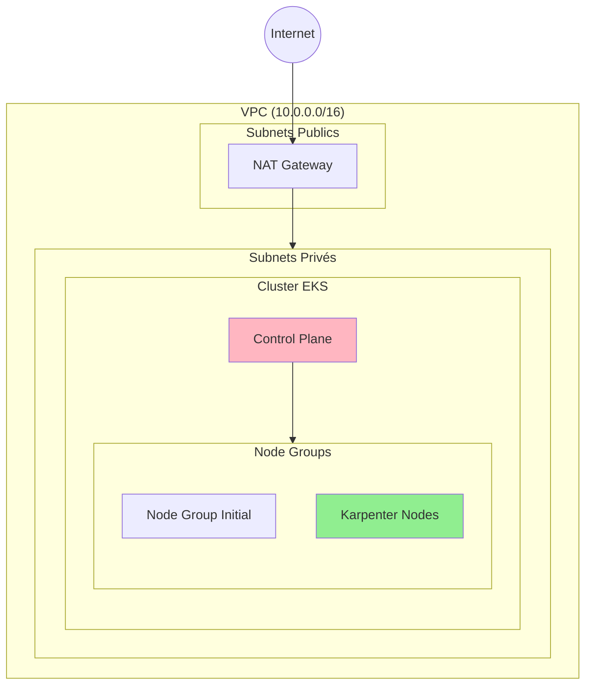

# Documentation AWS - EKS & Karpenter

Cette documentation couvre l'installation et la configuration d'un cluster EKS avec Karpenter sur un compte de formation AWS.

## Articles disponibles

1. **[Installation d'un cluster EKS](/pro/aws/eks-installation/)** - Déploiement d'un cluster EKS avec les contraintes d'un compte de formation AWS (SCP)

2. **[Installation de Karpenter](/pro/aws/karpenter-installation/)** - Installation et configuration de Karpenter pour l'autoscaling des nodes

3. **[Tests de Karpenter](/pro/aws/karpenter-tests/)** - Validation et tests du comportement de Karpenter

4. **[Glossaire AWS & Kubernetes](/pro/aws/glossaire/)** - Tous les termes et acronymes essentiels pour débuter

## Prérequis généraux

- Compte AWS (compte de formation ou standard)
- AWS CLI configuré
- kubectl installé
- Terraform >= 1.0
- Helm >= 3.0

## Architecture cible

