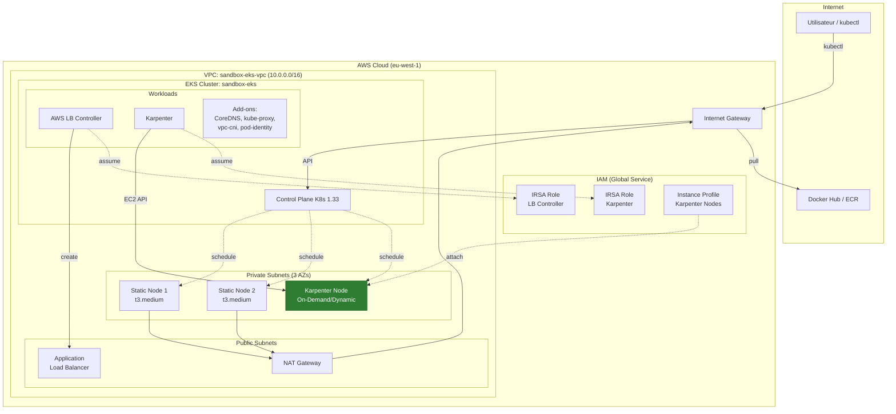

# Installation d'un cluster EKS avec un compte de formation AWS

Ce guide explique comment déployer un cluster **Amazon EKS** (Elastic Kubernetes Service) sur un compte de formation AWS qui possède des restrictions SCP (Service Control Policies).

---

## Architecture cible

```
                              Internet
                                  |
                                  v
                        +------------------+
                        | Internet Gateway |
                        +--------+---------+
                                 |
+--------------------------------+--------------------------------+
|                               VPC                                |
|                          10.0.0.0/16                            |
|                                |                                 |
|    +---------------------------+---------------------------+    |
|    |              Subnets Publics (3 AZs)                   |    |
|    |  +--------------+ +--------------+ +--------------+    |    |
|    |  | 10.0.48.0/24 | | 10.0.49.0/24 | | 10.0.50.0/24 |    |    |
|    |  |  eu-west-1a  | |  eu-west-1b  | |  eu-west-1c  |    |    |
|    |  +--------------+ +--------------+ +--------------+    |    |
|    |         |                                              |    |
|    |         |  +-------------------------------------+     |    |
|    |         |  |  Application Load Balancer (ALB)    |     |    |
|    |         |  |  (créé par AWS LB Controller)       |     |    |
|    |         |  +-------------------------------------+     |    |
|    +---------+----------------------------------------------+    |
|              |                                                   |
|              v                                                   |
|    +------------------+                                          |
|    |   NAT Gateway    | <-- Permet aux nodes privés              |
|    |  (Elastic IP)    |     d'accéder à internet                 |
|    +--------+---------+                                          |
|             |                                                    |
|    +--------+----------------------------------------------+    |
|    |        v        Subnets Privés (3 AZs)                |    |
|    |  +--------------+ +--------------+ +--------------+   |    |
|    |  | 10.0.0.0/20  | | 10.0.16.0/20 | | 10.0.32.0/20 |   |    |
|    |  |  eu-west-1a  | |  eu-west-1b  | |  eu-west-1c  |   |    |
|    |  |              | |              | |              |   |    |
|    |  | +---------+  | | +---------+  | |              |   |    |
|    |  | | Static  |  | | | Static  |  | |              |   |    |
|    |  | |t3.medium|  | | |t3.medium|  | |              |   |    |
|    |  | +---------+  | | +---------+  | |              |   |    |
|    |  |              | |              | | +---------+  |   |    |
|    |  |              | |              | | |Karpenter|  |   |    |
|    |  |              | |              | | |t3a.xlarge| |   |    |
|    |  |              | |              | | |(dynamic)|  |   |    |
|    |  |              | |              | | +---------+  |   |    |
|    |  +--------------+ +--------------+ +--------------+   |    |
|    |                                                        |    |
|    |                    ^         ^         ^               |    |
|    +--------------------+---------+---------+---------------+    |
|                         |         |         |                    |
|              +----------+---------+---------+----------+        |
|              |         EKS Control Plane               |        |
|              |      (Géré par AWS - invisible)         |        |
|              |                                         |        |
|              |  - API Server    - Controller Manager   |        |
|              |  - etcd          - Scheduler            |        |
|              |                                         |        |
|              |  Composants déployés :                  |        |
|              |  - Karpenter (autoscaling)              |        |
|              |  - AWS LB Controller                    |        |
|              |  - CoreDNS, kube-proxy, vpc-cni         |        |
|              +-----------------------------------------+        |
|                              ^                                   |
+------------------------------+-----------------------------------+
                               |
                         kubectl / API
                               |
                        +--------------+
                        | Ton poste    |
                        | (AWS CLI)    |
                        +--------------+
```

### Vue en diagramme Mermaid



---

## Composants déployés

### 1. VPC (Virtual Private Cloud)
- **CIDR** : `10.0.0.0/16` (65,536 adresses IP)
- **Région** : `eu-west-1` (Irlande)
- **Isolation** : Réseau privé virtuel dédié au cluster

### 2. Subnets

| Type | Quantité | Usage |
|------|----------|-------|
| Publics | 3 | Load Balancers, NAT Gateway |
| Privés | 3 | Worker nodes EKS (statiques et Karpenter) |

**Pourquoi 3 de chaque ?** Ce setup permet d'expérimenter des use cases de haute disponibilité sur 3 zones de disponibilité (AZs). Même s'il s'agit d'un cluster destiné à la formation, l'expérimentation ou des POC, cette configuration permet de tester des scénarios réalistes de distribution multi-AZ.

### 3. NAT Gateway
- Permet aux instances dans les subnets privés d'accéder à internet
- Nécessaire pour que les nodes puissent télécharger les images Docker
- **Mode single** : 1 seul NAT Gateway pour économiser (~45$/mois par NAT)

### 4. EKS Cluster
- **Control Plane** : Géré par AWS (tu ne le vois pas, tu ne paies que le service)
- **Version Kubernetes** : 1.33
- **Endpoint public** : Accessible depuis ton poste via internet

### 5. Node Group (Statique)
- **Type d'instances** : `t3.medium` (2 vCPU, 4 GB RAM)
- **Scaling** : min=1, max=3, desired=2
- **Placement** : Dans les subnets privés (sécurité)
- **Usage** : Workloads critiques (Karpenter, CoreDNS, etc.)

### 6. Karpenter (Autoscaling dynamique)
- **Rôle** : Crée automatiquement des nodes quand des pods sont en attente (Pending)
- **Types d'instances** : t3, t3a, t2 (medium à 2xlarge)
- **Capacity type** : On-Demand uniquement (Spot désactivé à cause des SCP)
- **Consolidation** : Supprime les nodes vides après 1 minute
- **Temps de provisioning** : ~30-40 secondes

### 7. AWS Load Balancer Controller
- **Rôle** : Crée automatiquement des ALB/NLB quand tu déploies un Ingress ou Service LoadBalancer
- **Authentification** : Via IRSA (IAM Roles for Service Accounts)

### 8. Add-ons EKS

| Add-on | Description |
|--------|-------------|
| CoreDNS | Résolution DNS interne au cluster |
| kube-proxy | Gestion des règles réseau (iptables) |
| vpc-cni | Plugin réseau AWS (IP natives du VPC) |
| pod-identity-agent | Authentification IAM pour les pods |

---

## Contraintes SCP (Service Control Policies)

Ce compte AWS a des restrictions organisationnelles qui impactent la configuration :

| Contrainte | Impact | Workaround |
|------------|--------|------------|
| KMS bloqué | Pas de chiffrement EBS natif | `encrypted: false` dans EC2NodeClass |
| SSM bloqué | Pas de lookup automatique d'AMI | AMI ID défini en dur |
| Spot SLR bloqué | Pas d'instances Spot | On-Demand uniquement |
| DescribeAZs bloqué | Pas de découverte dynamique | AZs définies en dur |

---

## Coûts estimés (sandbox)

| Ressource | Coût estimé/mois |
|-----------|------------------|
| EKS Control Plane | ~$73 |
| 2x t3.medium (static nodes) | ~$60 |
| NAT Gateway + data | ~$45 |
| Karpenter nodes (variable) | ~$0-50 (selon usage) |
| **Total** | **~$180-230/mois** |

> **Important** : Pense à détruire l'infrastructure quand tu ne l'utilises pas avec `terraform destroy`. Les nodes Karpenter sont automatiquement supprimés quand ils sont vides.

---

## Prérequis

- [x] AWS CLI installé et configuré
- [x] Terraform installé (`terraform version`)
- [x] kubectl installé

### Vérifier la configuration AWS CLI

```bash
# Vérifie que la CLI est bien configurée avec ta clé d'API
aws sts get-caller-identity
```

**Résultat attendu :**
```json
{
    "UserId": "AIDAXXXXXXXXXXXX",
    "Account": "123456789012",
    "Arn": "arn:aws:iam::123456789012:user/terraform-admin"
}
```

### Installation de kubectl (si nécessaire)

```powershell
# Via scoop (recommandé sur Windows)
scoop install kubectl

# Vérification
kubectl version --client
```

---

## Configuration Terraform

### Structure des fichiers

```
terraform/
├── versions.tf    # Contraintes de versions
├── providers.tf   # Configuration des providers (aws, kubernetes, helm, kubectl)
├── variables.tf   # Variables d'entrée
├── main.tf        # Ressources principales (VPC, EKS, Karpenter, LB Controller)
└── outputs.tf     # Valeurs de sortie
```

### versions.tf - Contraintes de versions

```hcl
terraform {
  required_version = ">= 1.0"

  required_providers {
    aws = {
      source  = "hashicorp/aws"
      version = "~> 5.0"
    }
    kubernetes = {
      source  = "hashicorp/kubernetes"
      version = "~> 2.20"
    }
    helm = {
      source  = "hashicorp/helm"
      version = "~> 2.12"
    }
    kubectl = {
      source  = "gavinbunney/kubectl"
      version = "~> 1.14"
    }
  }
}
```

### providers.tf - Configuration des providers

```hcl
provider "aws" {
  region = var.aws_region
}

provider "kubernetes" {
  host                   = module.eks.cluster_endpoint
  cluster_ca_certificate = base64decode(module.eks.cluster_certificate_authority_data)

  exec {
    api_version = "client.authentication.k8s.io/v1beta1"
    command     = "aws"
    args        = ["eks", "get-token", "--cluster-name", module.eks.cluster_name]
  }
}

provider "helm" {
  kubernetes {
    host                   = module.eks.cluster_endpoint
    cluster_ca_certificate = base64decode(module.eks.cluster_certificate_authority_data)
    exec {
      api_version = "client.authentication.k8s.io/v1beta1"
      command     = "aws"
      args        = ["eks", "get-token", "--cluster-name", module.eks.cluster_name]
    }
  }
}

provider "kubectl" {
  host                   = module.eks.cluster_endpoint
  cluster_ca_certificate = base64decode(module.eks.cluster_certificate_authority_data)
  exec {
    api_version = "client.authentication.k8s.io/v1beta1"
    command     = "aws"
    args        = ["eks", "get-token", "--cluster-name", module.eks.cluster_name]
  }
}
```

### variables.tf - Variables d'entrée

```hcl
variable "aws_region" {
  description = "AWS region"
  type        = string
  default     = "eu-west-1"
}

variable "cluster_name" {
  description = "EKS cluster name"
  type        = string
  default     = "sandbox-eks"
}

variable "cluster_version" {
  description = "Kubernetes version"
  type        = string
  default     = "1.33"
}

variable "environment" {
  description = "Environment tag"
  type        = string
  default     = "sandbox"
}
```

### main.tf - Ressources principales

#### Locals - Variables calculées

```hcl
locals {
  vpc_cidr = "10.0.0.0/16"

  # AZs définies en dur car la SCP bloque DescribeAvailabilityZones
  azs = ["eu-west-1a", "eu-west-1b", "eu-west-1c"]

  tags = {
    Environment = var.environment
    Project     = "eks-sandbox"
    ManagedBy   = "terraform"
  }
}
```

#### Module VPC

```hcl
module "vpc" {
  source  = "terraform-aws-modules/vpc/aws"
  version = "~> 5.0"

  name = "${var.cluster_name}-vpc"
  cidr = local.vpc_cidr

  azs             = local.azs
  private_subnets = [for k, v in local.azs : cidrsubnet(local.vpc_cidr, 4, k)]
  public_subnets  = [for k, v in local.azs : cidrsubnet(local.vpc_cidr, 8, k + 48)]

  enable_nat_gateway   = true
  single_nat_gateway   = true
  enable_dns_hostnames = true

  public_subnet_tags = {
    "kubernetes.io/role/elb" = 1
  }

  private_subnet_tags = {
    "kubernetes.io/role/internal-elb" = 1
    "karpenter.sh/discovery"          = var.cluster_name
  }

  tags = local.tags
}
```

**Calcul des subnets :**
```
VPC: 10.0.0.0/16

Private subnets (cidrsubnet avec /4 = /20):
  - 10.0.0.0/20   (AZ-a)
  - 10.0.16.0/20  (AZ-b)
  - 10.0.32.0/20  (AZ-c)

Public subnets (cidrsubnet avec /8 = /24, offset 48):
  - 10.0.48.0/24  (AZ-a)
  - 10.0.49.0/24  (AZ-b)
  - 10.0.50.0/24  (AZ-c)
```

#### Module EKS

```hcl
module "eks" {
  source  = "terraform-aws-modules/eks/aws"
  version = "~> 20.0"

  cluster_name    = var.cluster_name
  cluster_version = var.cluster_version

  cluster_endpoint_public_access = true

  vpc_id     = module.vpc.vpc_id
  subnet_ids = module.vpc.private_subnets

  # Workarounds SCP
  create_kms_key              = false
  create_cloudwatch_log_group = false
  cluster_encryption_config   = {}

  eks_managed_node_groups = {
    default = {
      name           = "default-node-group"
      instance_types = ["t3.medium"]
      min_size       = 1
      max_size       = 3
      desired_size   = 2
    }
  }

  enable_cluster_creator_admin_permissions = true

  tags = local.tags
}
```

### outputs.tf - Valeurs de sortie

```hcl
output "cluster_name" {
  description = "EKS cluster name"
  value       = module.eks.cluster_name
}

output "configure_kubectl" {
  description = "Command to configure kubectl"
  value       = "aws eks update-kubeconfig --region ${var.aws_region} --name ${module.eks.cluster_name}"
}
```

---

## Guide de déploiement

### Étape 1 : Initialisation Terraform

```bash
cd terraform
terraform init
```

**Ce que ça fait :**
- Télécharge le provider AWS (~100 MB)
- Télécharge les providers Kubernetes, Helm, Kubectl
- Télécharge les modules VPC, EKS et Karpenter depuis le registry Terraform
- Crée le dossier `.terraform/` avec les plugins
- Crée `.terraform.lock.hcl` pour verrouiller les versions

### Étape 2 : Planification

```bash
terraform plan
```

**Résultat attendu :**
```
Plan: 70+ to add, 0 to change, 0 to destroy.
```

### Étape 3 : Déploiement

```bash
terraform apply
```

**Durée estimée : 15-20 minutes**

Le plus long est la création du cluster EKS lui-même (~10 min).

**Résultat attendu :**
```
Apply complete! Resources: 70+ added, 0 changed, 0 destroyed.

Outputs:

cluster_name = "sandbox-eks"
cluster_endpoint = "https://XXXXX.yl4.eu-west-1.eks.amazonaws.com"
configure_kubectl = "aws eks update-kubeconfig --region eu-west-1 --name sandbox-eks"
```

### Étape 4 : Configuration de kubectl

Copie-colle la commande affichée dans les outputs :

```bash
aws eks update-kubeconfig --region eu-west-1 --name sandbox-eks
```

**Vérification :**
```bash
# Vérifie la connexion
kubectl cluster-info

# Liste les nodes
kubectl get nodes

# Liste les pods système
kubectl get pods -A
```

### Étape 5 : Vérification de Karpenter

```bash
# Pods Karpenter (2 replicas)
kubectl get pods -n kube-system -l app.kubernetes.io/name=karpenter

# Ressources Karpenter
kubectl get nodepools,ec2nodeclasses

# Détails du NodePool
kubectl describe nodepool default
```

**Résultat attendu :**
```
NAME                            NODECLASS   NODES   READY   AGE
nodepool.karpenter.sh/default   default     0       True    5m

NAME                                     READY   AGE
ec2nodeclass.karpenter.k8s.aws/default   True    5m
```

> **Note** : `NODES: 0` est normal - Karpenter ne crée des nodes que quand des pods sont en attente.

---

## Test du cluster

### Déployer une application de test

```bash
# Crée un déploiement nginx
kubectl create deployment nginx --image=nginx

# Expose le déploiement
kubectl expose deployment nginx --port=80 --type=LoadBalancer

# Attends que le LoadBalancer soit provisionné (2-3 min)
kubectl get svc nginx -w
```

Quand l'EXTERNAL-IP apparaît, ouvre-la dans ton navigateur !

### Nettoyage du test

```bash
kubectl delete deployment nginx
kubectl delete svc nginx
```

---

## Destruction de l'infrastructure

**Important** : Pour éviter les coûts, détruis l'infrastructure quand tu ne l'utilises pas.

```bash
terraform destroy
```

**Durée estimée : 10-15 minutes**

---

## Commandes utiles

### Terraform

| Commande | Description |
|----------|-------------|
| `terraform init` | Initialise le projet |
| `terraform plan` | Prévisualise les changements |
| `terraform apply` | Applique les changements |
| `terraform destroy` | Supprime tout |
| `terraform output` | Affiche les outputs |

### kubectl

| Commande | Description |
|----------|-------------|
| `kubectl get nodes` | Liste les nodes |
| `kubectl get pods -A` | Liste tous les pods |
| `kubectl get svc -A` | Liste tous les services |
| `kubectl describe node <name>` | Détails d'un node |
| `kubectl logs <pod> -n <ns>` | Logs d'un pod |

---

## Troubleshooting

### Erreurs générales

**"Error: No valid credential sources found"**
→ Vérifie que `aws configure` a bien été fait

**"Error: creating EKS Cluster: AccessDeniedException"**
→ L'utilisateur IAM n'a pas les permissions suffisantes

**"kubectl: Unable to connect to the server"**
→ Lance `aws eks update-kubeconfig --region eu-west-1 --name sandbox-eks`

### Erreurs SCP (spécifiques à ce compte)

**"Error: creating KMS Key: AccessDeniedException"**
→ Le module EKS doit avoir `create_kms_key = false`

**"Error: creating CloudWatch Log Group: AccessDeniedException"**
→ Le module EKS doit avoir `create_cloudwatch_log_group = false`

---

## Prochaine étape

Une fois le cluster EKS opérationnel, vous pouvez passer à l'[Installation de Karpenter](/pro/aws/karpenter-installation/).
