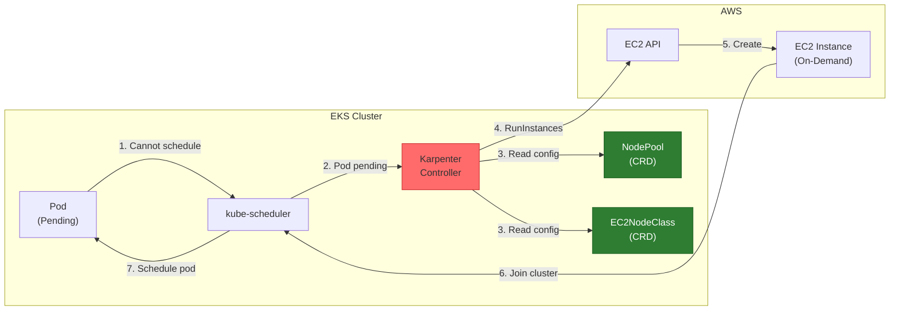

# Installation de Karpenter sur un cluster EKS

Ce guide explique comment installer et configurer **Karpenter** sur un cluster EKS, avec une attention particuliere aux contraintes des comptes de formation AWS (SCP).

> **Prerequis** : Avoir un cluster EKS operationnel. Voir [Installation d'un cluster EKS](/pro/aws/eks-installation/).

---

## Qu'est-ce que Karpenter ?

**Karpenter** est un autoscaler Kubernetes open-source developpe par AWS qui provisionne automatiquement des nodes en fonction des besoins reels de vos workloads.

### Fonctionnalites principales

| Fonctionnalite | Description |
|----------------|-------------|
| **Autoscaling intelligent** | Provisionne automatiquement les nodes EC2 en fonction des pods en attente |
| **Optimisation des couts** | Selectionne les types d'instances les plus economiques selon les contraintes |
| **Rapidite** | Provisionne des nodes en ~40 secondes (vs 3-5 min avec Cluster Autoscaler) |
| **Consolidation** | Remplace automatiquement plusieurs petits nodes par un seul plus gros pour reduire les couts |
| **Flexibilite** | Peut utiliser n'importe quel type d'instance EC2 (Spot, On-Demand, ARM, x86) |

### Karpenter vs Cluster Autoscaler

| Critere | Cluster Autoscaler | Karpenter |
|---------|-------------------|-----------|
| Vitesse de provisioning | 3-5 minutes | ~40 secondes |
| Configuration | Node Groups predefinis | Selection dynamique d'instances |
| Optimisation des couts | Limitee | Avancee (bin-packing, Spot) |
| Gestion du cycle de vie | Basique | Avancee (consolidation, expiration) |
| Complexite | Simple | Moderee |

---

## Architecture avec Karpenter



### Composants a installer

| Composant | Type | Description |
|-----------|------|-------------|
| **Module Karpenter** | IAM Resources | Roles IAM, Instance Profile |
| **Module IRSA** | IAM Resources | Role IRSA pour le controller |
| **Helm Release** | Kubernetes | Deployment du controller Karpenter |
| **NodePool** | CRD Kubernetes | Configuration des contraintes de nodes |
| **EC2NodeClass** | CRD Kubernetes | Configuration EC2 (AMI, subnets, SG) |
| **Tags** | AWS EC2 | Tags sur les security groups |

---

## Configuration Terraform pour compte de formation (SCP)

### Restrictions SCP rencontrees

| Service | Action bloquee | Impact sur Karpenter |
|---------|---------------|---------------------|
| **SQS** | `sqs:CreateQueue` | Pas de gestion des interruptions Spot |
| **EventBridge** | `events:PutRule` | Pas de notifications |
| **Pod Identity** | `eks-auth:AssumeRoleForPodIdentity` | Doit utiliser IRSA |
| **SSM** | `ssm:GetParameter` | Pas de lookup AMI dynamique |
| **KMS** | `kms:CreateKey` | Pas de chiffrement EBS |
| **Spot SLR** | `iam:CreateServiceLinkedRole` | Pas d'instances Spot |

### Module Karpenter

```hcl
# Module Karpenter - Provisionne les ressources IAM pour Karpenter
# Note: SQS, EventBridge et Pod Identity desactives - SCP du compte les bloque
module "karpenter" {
  source  = "terraform-aws-modules/eks/aws//modules/karpenter"
  version = "~> 20.0"

  cluster_name = module.eks.cluster_name

  # Utiliser IRSA (Pod Identity bloque par SCP)
  enable_irsa                     = true
  irsa_oidc_provider_arn          = module.eks.oidc_provider_arn
  irsa_namespace_service_accounts = ["kube-system:karpenter"]

  # Desactiver Pod Identity (bloque par SCP)
  enable_pod_identity             = false
  create_pod_identity_association = false

  # Creer l'instance profile pour les nodes Karpenter
  node_iam_role_use_name_prefix = false
  node_iam_role_name            = "${var.cluster_name}-karpenter-node"

  tags = local.tags
}
```

### Helm Release Karpenter

```hcl
# Helm release pour Karpenter
resource "helm_release" "karpenter" {
  namespace  = "kube-system"
  name       = "karpenter"
  repository = "oci://public.ecr.aws/karpenter"
  chart      = "karpenter"
  version    = "1.1.1"
  wait       = false

  set {
    name  = "settings.clusterName"
    value = module.eks.cluster_name
  }

  set {
    name  = "settings.clusterEndpoint"
    value = module.eks.cluster_endpoint
  }

  set {
    name  = "serviceAccount.annotations.eks\\.amazonaws\\.com/role-arn"
    value = module.karpenter.iam_role_arn
  }

  depends_on = [
    module.eks,
    module.karpenter
  ]
}
```

### NodePool

```hcl
resource "kubectl_manifest" "karpenter_node_pool" {
  yaml_body = <<-YAML
    apiVersion: karpenter.sh/v1
    kind: NodePool
    metadata:
      name: default
    spec:
      template:
        metadata:
          labels:
            karpenter.sh/nodepool: default
        spec:
          nodeClassRef:
            group: karpenter.k8s.aws
            kind: EC2NodeClass
            name: default
          requirements:
            - key: "karpenter.sh/capacity-type"
              operator: In
              values: ["on-demand"]  # Spot desactive (SCP bloque le SLR)
            - key: "kubernetes.io/arch"
              operator: In
              values: ["amd64"]
            - key: "karpenter.k8s.aws/instance-category"
              operator: In
              values: ["t"]
            - key: "karpenter.k8s.aws/instance-family"
              operator: In
              values: ["t3", "t3a", "t2"]
            - key: "karpenter.k8s.aws/instance-size"
              operator: In
              values: ["medium", "large", "xlarge", "2xlarge"]
      limits:
        cpu: "100"
        memory: "200Gi"
      disruption:
        consolidationPolicy: WhenEmptyOrUnderutilized
        consolidateAfter: 1m
        budgets:
          - nodes: "10%"
  YAML

  depends_on = [helm_release.karpenter]
}
```

#### Explication des requirements

| Requirement | Valeurs | Signification |
|-------------|---------|---------------|
| `capacity-type` | on-demand | On-Demand uniquement (Spot bloque par SCP) |
| `arch` | amd64 | Architecture x86_64 (pas ARM) |
| `instance-category` | t | Categorie T (burstable) |
| `instance-family` | t3, t3a, t2 | Familles d'instances autorisees |
| `instance-size` | medium a 2xlarge | Tailles d'instances (2 a 8 vCPUs) |

#### Explication de la disruption

| Parametre | Valeur | Signification |
|-----------|--------|---------------|
| `consolidationPolicy` | WhenEmptyOrUnderutilized | Consolide les nodes vides OU sous-utilises |
| `consolidateAfter` | 1m | Attend 1 minute avant de consolider |
| `budgets` | 10% | Maximum 10% des nodes peuvent etre disruptes simultanement |

### EC2NodeClass

```hcl
resource "kubectl_manifest" "karpenter_node_class" {
  yaml_body = <<-YAML
    apiVersion: karpenter.k8s.aws/v1
    kind: EC2NodeClass
    metadata:
      name: default
    spec:
      amiFamily: AL2023
      # AMI specifiee en dur car ssm:GetParameter est bloque par SCP
      amiSelectorTerms:
        - id: ami-05521d50f4e9c827d  # amazon-eks-node-al2023-x86_64-standard-1.33 eu-west-1
      # instanceProfile au lieu de role car Karpenter ne peut pas creer d'instance profile
      instanceProfile: ${module.karpenter.instance_profile_name}
      subnetSelectorTerms:
        - tags:
            karpenter.sh/discovery: ${var.cluster_name}
      securityGroupSelectorTerms:
        - tags:
            karpenter.sh/discovery: ${module.eks.cluster_name}
      tags:
        karpenter.sh/discovery: ${module.eks.cluster_name}
        Environment: ${var.environment}
        Project: "eks-sandbox"
        ManagedBy: "karpenter"
      blockDeviceMappings:
        - deviceName: /dev/xvda
          ebs:
            volumeSize: 20Gi
            volumeType: gp3
            encrypted: false  # KMS bloque par SCP
            deleteOnTermination: true
  YAML

  depends_on = [helm_release.karpenter]
}
```

#### Points cles de la configuration

| Parametre | Valeur | Raison |
|-----------|--------|--------|
| `amiSelectorTerms.id` | AMI fixe | SSM bloque par SCP |
| `instanceProfile` | Pre-cree | Karpenter ne peut pas creer d'instance profile |
| `encrypted: false` | Pas de chiffrement | KMS bloque par SCP |

### Tags sur les Security Groups

```hcl
# Ajouter le tag karpenter.sh/discovery aux security groups
resource "aws_ec2_tag" "cluster_security_group_tag" {
  for_each    = toset([module.eks.cluster_security_group_id])
  resource_id = each.value
  key         = "karpenter.sh/discovery"
  value       = module.eks.cluster_name
}

resource "aws_ec2_tag" "node_security_group_tag" {
  for_each    = toset([module.eks.node_security_group_id])
  resource_id = each.value
  key         = "karpenter.sh/discovery"
  value       = module.eks.cluster_name
}
```

---

## Guide d'installation

### Etape 1 : Initialiser les providers

```bash
cd terraform
terraform init -upgrade
```

### Etape 2 : Verifier les changements

```bash
terraform plan
```

Vous devriez voir :
- `module.karpenter` (IAM resources)
- `helm_release.karpenter`
- `kubectl_manifest.karpenter_node_pool`
- `kubectl_manifest.karpenter_node_class`
- `aws_ec2_tag.cluster_security_group_tag`
- `aws_ec2_tag.node_security_group_tag`

### Etape 3 : Deployer

```bash
terraform apply
```

**Duree estimee : 3-5 minutes**

---

## Verification de l'installation

### 1. Verifier les pods Karpenter

```bash
kubectl get pods -n kube-system -l app.kubernetes.io/name=karpenter
```

**Sortie attendue :**
```
NAME                         READY   STATUS    RESTARTS   AGE
karpenter-5d7f8c9b4d-xxxxx   1/1     Running   0          2m
karpenter-5d7f8c9b4d-yyyyy   1/1     Running   0          2m
```

### 2. Verifier le NodePool

```bash
kubectl get nodepool
```

**Sortie attendue :**
```
NAME      NODECLASS   NODES   READY   AGE
default   default     0       True    5m
```

### 3. Verifier l'EC2NodeClass

```bash
kubectl get ec2nodeclass
```

**Sortie attendue :**
```
NAME      READY   AGE
default   True    5m
```

### 4. Verifier les logs

```bash
kubectl logs -n kube-system -l app.kubernetes.io/name=karpenter --tail=20
```

---

## Commandes utiles

### Karpenter

| Commande | Description |
|----------|-------------|
| `kubectl get nodepools` | Liste les NodePools |
| `kubectl get ec2nodeclasses` | Liste les EC2NodeClasses |
| `kubectl get nodeclaims` | Liste les NodeClaims (nodes en cours/crees) |
| `kubectl describe nodepool default` | Details du NodePool |
| `kubectl logs -n kube-system -l app.kubernetes.io/name=karpenter -f` | Logs Karpenter en temps reel |

### Gestion des nodes

```bash
# Voir les nodes crees par Karpenter
kubectl get nodes -l karpenter.sh/nodepool=default

# Voir les NodeClaims
kubectl get nodeclaims

# Details du NodeClaim
kubectl describe nodeclaim
```

### Administration

```bash
# Forcer la consolidation
kubectl annotate nodepool default karpenter.sh/do-not-disrupt-

# Desactiver temporairement Karpenter
kubectl scale deployment karpenter -n kube-system --replicas=0

# Reactiver Karpenter
kubectl scale deployment karpenter -n kube-system --replicas=2
```

---

## Troubleshooting

### Probleme : Pods Karpenter en CrashLoopBackOff

**Cause probable :** Pod Identity bloque par SCP

**Solution :** Utiliser IRSA au lieu de Pod Identity

```bash
# Verifier les logs
kubectl logs -n kube-system -l app.kubernetes.io/name=karpenter

# Si erreur "eks-auth:AssumeRoleForPodIdentity"
# -> Configurer IRSA comme dans la section compte formation
```

### Probleme : EC2NodeClass READY: False

**Cause probable :** AMI lookup echoue (SSM bloque)

**Solution :** Specifier l'AMI ID en dur

```yaml
amiSelectorTerms:
  - id: ami-05521d50f4e9c827d  # Remplacer par l'AMI de votre region
```

**Trouver l'AMI (depuis un compte avec acces SSM) :**
```bash
aws ssm get-parameter \
  --name /aws/service/eks/optimized-ami/1.33/amazon-linux-2023/x86_64/standard/recommended/image_id \
  --query "Parameter.Value" --output text
```

### Probleme : Karpenter ne peut pas creer de nodes

**Verifier les erreurs IAM :**
```bash
kubectl logs -n kube-system -l app.kubernetes.io/name=karpenter | grep -i error
```

**Causes possibles :**
- Instance Profile manquant → Utiliser `instanceProfile:` au lieu de `role:`
- Permissions EC2 manquantes → Verifier la policy IRSA
- Security groups non trouves → Ajouter les tags `karpenter.sh/discovery`

### Probleme : "SecurityGroupSelector did not match any SecurityGroups"

**Solution :** Verifier et ajouter les tags sur les security groups

```bash
# Verifier les tags existants
aws ec2 describe-security-groups --filters "Name=tag:Name,Values=*sandbox-eks-node*" \
  --query "SecurityGroups[*].Tags"

# Si le tag manque, reappliquer avec Terraform
terraform apply -target=aws_ec2_tag.node_security_group_tag
```

### Warnings non bloquants

Avec un compte formation, vous verrez ces warnings dans les logs Karpenter :

```
ERROR pricing.GetProducts, failed to get products ... AccessDeniedException
```

Ce warning n'empeche pas Karpenter de fonctionner. Karpenter utilisera des valeurs par defaut pour le pricing.

---

## Bonnes pratiques

1. **Toujours definir des limites** : Evitez les couts imprevus
2. **Diversifiez les types d'instances** : Augmentez la disponibilite
3. **Activez la consolidation** : Optimisez l'utilisation
4. **Monitorez activement** : Suivez les metriques et les couts
5. **Testez en sandbox** : Validez la configuration avant production

---

## Ressources

- [Documentation officielle Karpenter](https://karpenter.sh/)
- [Guide AWS pour Karpenter](https://aws.github.io/aws-eks-best-practices/karpenter/)
- [Module Terraform Karpenter](https://github.com/terraform-aws-modules/terraform-aws-eks/tree/master/modules/karpenter)
- [Exemples de NodePools](https://karpenter.sh/docs/concepts/nodepools/)

---

## Prochaine etape

Une fois Karpenter installe et operationnel, vous pouvez passer aux [Tests de Karpenter](/pro/aws/karpenter-tests/).
