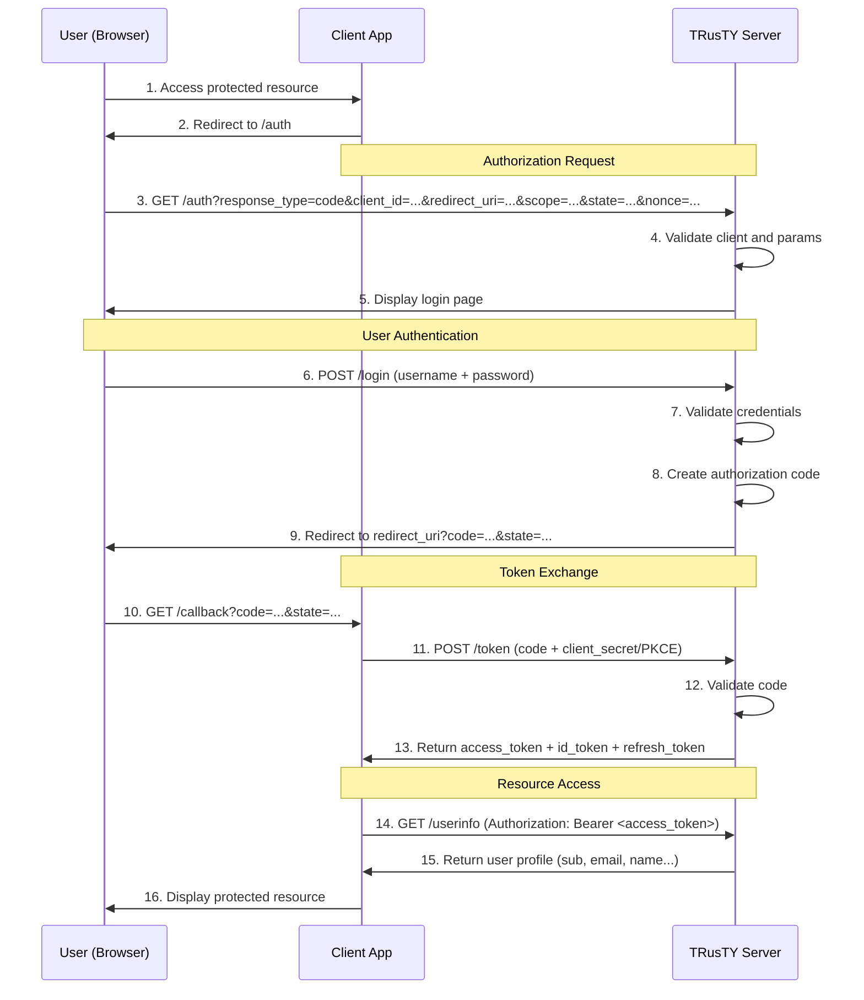
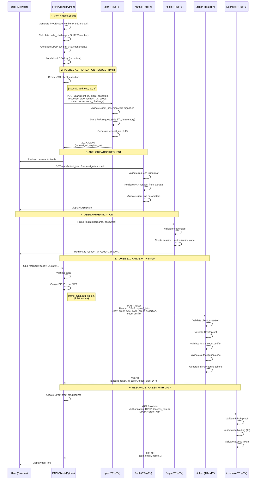
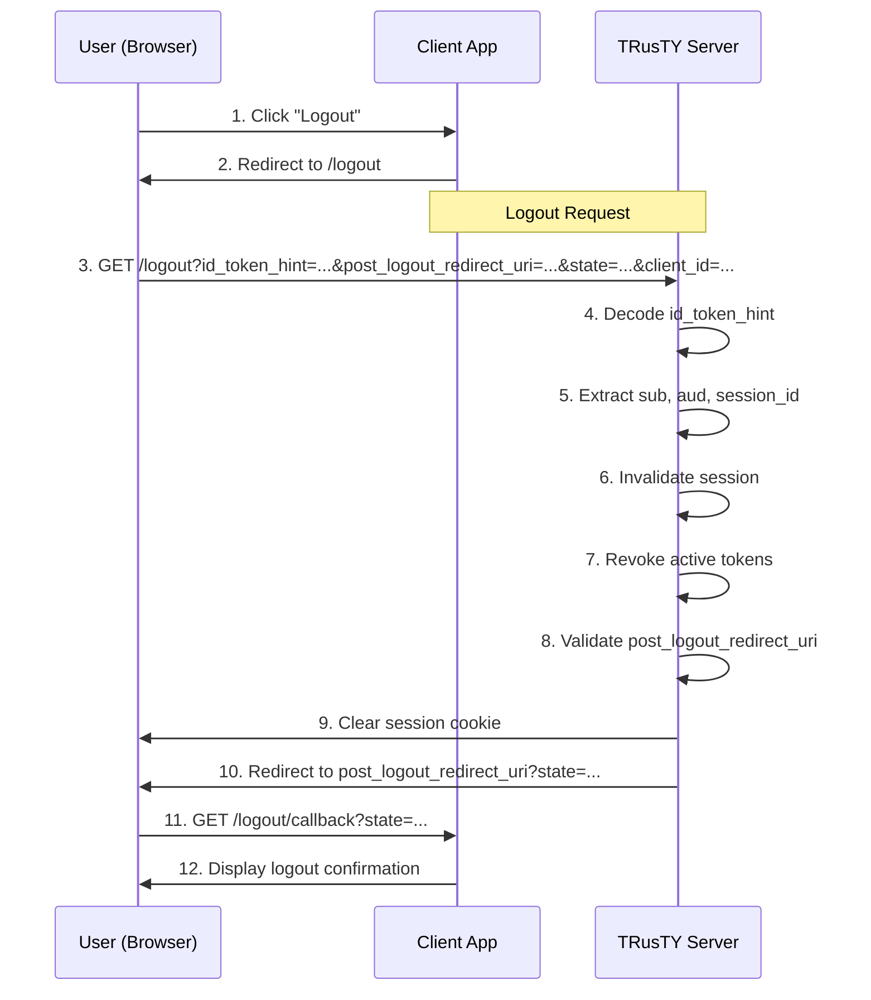

# OIDC & FAPI 2.0 Flows - TRusTY

> **Last update**: 2025-11-30 - Version 0.8.1
> **Specification compliance**: OpenID Connect Core 1.0 + FAPI 2.0 Security Profile

This document describes the complete authentication flows implemented in TRusTY, including both standard OIDC and FAPI 2.0 (Financial-grade API) flows.

---

## Table of Contents

1. [Supported Flows](#supported-flows)
2. [Standard OIDC Authorization Code Flow](#standard-oidc-authorization-code-flow)
3. [FAPI 2.0 Flow with PAR](#fapi-20-flow-with-par)
4. [Logout Flow (RP-Initiated)](#logout-flow-rp-initiated)
5. [Security Features](#security-features)
6. [API Endpoints](#api-endpoints)

---

## Supported Flows

TRusTY implements multiple authentication flows to support different security requirements:

| Flow | Security Level | Use Case | Standards |
|------|---------------|----------|-----------|
| **Standard OIDC** | Basic | Web applications | OIDC Core 1.0 + PKCE |
| **FAPI 2.0 with PAR** | Financial-grade | Banking, high-security APIs | FAPI 2.0 + PAR + DPoP + private_key_jwt |
| **RP-Initiated Logout** | - | Session termination | OIDC RP-Initiated Logout 1.0 |

---

## Standard OIDC Authorization Code Flow

### Flow Diagram



### Detailed Steps

#### 1-2. Initial Request
- User accesses a protected resource
- Client redirects to authorization endpoint

#### 3-4. Authorization Request
**Endpoint**: `GET /auth`

**Required parameters**:
- `response_type=code` (only Authorization Code Flow supported)
- `client_id` - Client application identifier
- `redirect_uri` - Callback URL (must be pre-registered)
- `scope` - Requested scopes (e.g., `openid email profile`)

**Optional parameters**:
- `state` - CSRF protection token (recommended)
- `nonce` - Replay protection for ID token (recommended)
- `code_challenge` - PKCE challenge (S256 method)
- `code_challenge_method` - Always `S256`
- `prompt` - UI behavior (`none`, `login`, `consent`)
- `max_age` - Maximum authentication age
- `ui_locales` - Preferred language (`en`, `fr`)

#### 5-6. User Authentication
- Server displays login page (localized in EN/FR)
- User submits credentials via POST `/login`

#### 7-9. Authorization Code Generation
- Server validates credentials
- Creates short-lived authorization code (90 seconds TTL)
- Redirects to client's `redirect_uri` with code

#### 10-13. Token Exchange
**Endpoint**: `POST /token`

**Request** (form-encoded):
```http
POST /token HTTP/1.1
Content-Type: application/x-www-form-urlencoded

grant_type=authorization_code
&code=<authorization_code>
&redirect_uri=<same_redirect_uri>
&client_id=<client_id>
&client_secret=<client_secret>  // or PKCE code_verifier
&code_verifier=<pkce_verifier>   // if PKCE was used
```

**Response** (JSON):
```json
{
  "access_token": "eyJhbGc...",
  "token_type": "Bearer",
  "expires_in": 3600,
  "id_token": "eyJhbGc...",
  "refresh_token": "refresh_xyz...",
  "scope": "openid email profile"
}
```

**ID Token Claims** (JWT):
```json
{
  "iss": "https://trusty.example.com",
  "sub": "a1b2c3d4-5678-90ab-cdef-1234567890ab",  // UUID (stable)
  "aud": "demo_client",
  "exp": 1701388800,
  "iat": 1701385200,
  "nonce": "xyz123...",
  "email": "alice@example.com",
  "email_verified": true,
  "name": "Alice Smith"
}
```

#### 14-15. UserInfo Access
**Endpoint**: `GET /userinfo`

**Request**:
```http
GET /userinfo HTTP/1.1
Authorization: Bearer <access_token>
```

**Response** (JSON):
```json
{
  "sub": "a1b2c3d4-5678-90ab-cdef-1234567890ab",
  "email": "alice@example.com",
  "email_verified": true,
  "name": "Alice Smith",
  "preferred_username": "alice"
}
```

---

## FAPI 2.0 Flow with PAR

### Enhanced Security Features

FAPI 2.0 (Financial-grade API) adds advanced security mechanisms:

| Feature | Specification | Purpose |
|---------|--------------|---------|
| **PAR** (Pushed Authorization Request) | RFC 9126 | Pre-register authorization parameters server-side |
| **PKCE** (S256) | RFC 7636 | Mandatory - Prevent code interception |
| **private_key_jwt** | RFC 7523 | Client authentication with asymmetric keys |
| **DPoP** | RFC 9449 | Token binding - Prevent token theft/replay |

### Complete FAPI 2.0 Flow Diagram



### Detailed FAPI 2.0 Steps

#### 1. Key Generation

**PKCE** (Proof Key for Code Exchange):
```python
import base64, hashlib, secrets

# Generate verifier (43-128 random characters)
code_verifier = base64.urlsafe_b64encode(secrets.token_bytes(32)).decode('utf-8').rstrip('=')

# Calculate challenge (SHA-256 hash)
challenge = hashlib.sha256(code_verifier.encode('utf-8')).digest()
code_challenge = base64.urlsafe_b64encode(challenge).decode('utf-8').rstrip('=')
```

**DPoP Keys** (ephemeral for this session):
```python
from cryptography.hazmat.primitives.asymmetric import rsa

dpop_private_key = rsa.generate_private_key(
    public_exponent=65537,
    key_size=2048
)
```

**Client Authentication Keys** (persistent, pre-registered):
- Private key stored securely
- Public key (JWKS) registered with TRusTY

#### 2. Pushed Authorization Request (PAR)

**Endpoint**: `POST /par`

**Client Assertion JWT** (signed with client private key):
```json
{
  "iss": "demo_client",
  "sub": "demo_client",
  "aud": "https://trusty.example.com/par",
  "exp": 1701385260,
  "iat": 1701385200,
  "jti": "unique-jwt-id-123"
}
```

**PAR Request** (form-encoded):
```http
POST /par HTTP/1.1
Content-Type: application/x-www-form-urlencoded

client_id=demo_client
&client_assertion=eyJhbGc...  # JWT signed with client private key
&client_assertion_type=urn:ietf:params:oauth:client-assertion-type:jwt-bearer
&response_type=code
&redirect_uri=https://client.example.com/callback
&scope=openid+email+profile
&state=xyz123
&nonce=abc456
&code_challenge=E9Melhoa...
&code_challenge_method=S256
```

**PAR Response**:
```json
{
  "request_uri": "urn:ietf:params:oauth:request_uri:a1b2c3d4-...",
  "expires_in": 90
}
```

#### 3. Authorization Request with request_uri

**Simplified authorization request**:
```http
GET /auth?client_id=demo_client&request_uri=urn:ietf:params:oauth:request_uri:a1b2c3d4-... HTTP/1.1
```

All other parameters (redirect_uri, scope, PKCE, etc.) are retrieved from the PAR request stored server-side.

#### 5. Token Exchange with DPoP

**DPoP Proof JWT** (signed with DPoP private key):
```json
{
  "typ": "dpop+jwt",
  "alg": "RS256",
  "jwk": {  // DPoP public key
    "kty": "RSA",
    "n": "0vx7agoebGc...",
    "e": "AQAB"
  }
}
// Payload:
{
  "jti": "dpop-proof-123",
  "htm": "POST",
  "htu": "https://trusty.example.com/token",
  "iat": 1701385200,
  "nonce": "server-provided-nonce"  // if server requires
}
```

**Token Request**:
```http
POST /token HTTP/1.1
Content-Type: application/x-www-form-urlencoded
DPoP: eyJhbGc...  # DPoP proof JWT

grant_type=authorization_code
&code=authorization_code_123
&redirect_uri=https://client.example.com/callback
&client_id=demo_client
&client_assertion=eyJhbGc...  # New JWT for /token endpoint
&client_assertion_type=urn:ietf:params:oauth:client-assertion-type:jwt-bearer
&code_verifier=dBjftJeZ...  # PKCE verifier
```

**Token Response**:
```json
{
  "access_token": "eyJhbGc...",
  "token_type": "DPoP",  // Not "Bearer"!
  "expires_in": 3600,
  "id_token": "eyJhbGc...",
  "refresh_token": "refresh_xyz..."
}
```

**Access Token contains** `cnf.jkt` (JWK Thumbprint):
```json
{
  "iss": "https://trusty.example.com",
  "sub": "a1b2c3d4-...",
  "aud": "demo_client",
  "exp": 1701388800,
  "cnf": {
    "jkt": "0ZcOCORZNYy-DWpqq30j..."  // SHA-256 thumbprint of DPoP public key
  }
}
```

#### 6. UserInfo Access with DPoP

**New DPoP Proof** for GET /userinfo:
```json
{
  "jti": "dpop-proof-456",
  "htm": "GET",  // Changed from POST
  "htu": "https://trusty.example.com/userinfo",  // Changed endpoint
  "iat": 1701385300,
  "ath": "fUHyO2T1..."  // Hash of access token (optional)
}
```

**UserInfo Request**:
```http
GET /userinfo HTTP/1.1
Authorization: DPoP eyJhbGc...  # access_token (not "Bearer"!)
DPoP: eyJhbGc...  # New proof for this request
```

---

## Logout Flow (RP-Initiated)

### RP-Initiated Logout Diagram



### Logout Request Parameters

**Endpoint**: `GET /logout`

**Parameters**:
- `id_token_hint` - ID token received during login (recommended)
- `post_logout_redirect_uri` - Where to redirect after logout (must be pre-registered)
- `state` - State to maintain across logout flow
- `client_id` - Client identifier (optional if in id_token_hint)
- `ui_locales` - Logout page language

**Example**:
```http
GET /logout?id_token_hint=eyJhbGc...&post_logout_redirect_uri=https://client.example.com/&state=xyz HTTP/1.1
```

---

## Security Features

### Implemented Security Mechanisms

| Feature | Standard | Implementation |
|---------|----------|----------------|
| **PKCE (S256)** | RFC 7636 | Mandatory for all flows |
| **State parameter** | RFC 6749 | CSRF protection |
| **Nonce** | OIDC Core | ID token replay protection |
| **private_key_jwt** | RFC 7523 | Asymmetric client authentication |
| **DPoP** | RFC 9449 | Token binding (jkt verification) |
| **PAR** | RFC 9126 | Pre-register authorization params |
| **JWT Request Objects** | RFC 9101 | Signed authorization requests |
| **Stable sub claim** | OIDC Core | UUID (not email) |
| **Token revocation** | RFC 7009 | Explicit token invalidation |
| **Session management** | - | Server-side session tracking |

### PKCE Flow Protection

```
1. Client generates code_verifier (random string)
2. Client calculates code_challenge = SHA256(code_verifier)
3. Client sends code_challenge in /auth request
4. Server stores code_challenge with authorization code
5. Client sends code_verifier in /token request
6. Server validates: SHA256(received_verifier) == stored_challenge
7. If match: issue tokens. If not: reject with invalid_grant
```

### DPoP Token Binding

```
1. Client generates ephemeral DPoP key pair
2. Client creates DPoP proof (JWT signed with DPoP private key)
3. Server validates DPoP proof signature
4. Server calculates JWK thumbprint (jkt) of DPoP public key
5. Server embeds jkt in access_token (cnf.jkt claim)
6. For each resource request:
   a. Client sends new DPoP proof + access_token
   b. Server validates proof signature
   c. Server extracts jkt from access_token
   d. Server calculates jkt from proof's JWK
   e. If jkt values match: grant access. If not: reject 401
```

---

## API Endpoints

### Discovery & Configuration

| Endpoint | Method | Description |
|----------|--------|-------------|
| `/.well-known/openid-configuration` | GET | OIDC Discovery metadata |
| `/.well-known/jwks.json` | GET | Server public keys (JWKS) |

### Core OIDC Endpoints

| Endpoint | Method | Description | Auth Required |
|----------|--------|-------------|---------------|
| `/auth` | GET | Authorization endpoint | No |
| `/login` | GET/POST | User authentication page | No |
| `/token` | POST | Token exchange | Client auth |
| `/userinfo` | GET | User profile | Access token |
| `/logout` | GET | RP-initiated logout | No |
| `/revoke` | POST | Token revocation | Client auth |

### FAPI 2.0 Endpoints

| Endpoint | Method | Description | Auth Required |
|----------|--------|-------------|---------------|
| `/par` | POST | Pushed Authorization Request | Client auth (private_key_jwt) |
| `/introspect` | POST | Token introspection | Client auth |

### Utility Endpoints

| Endpoint | Method | Description |
|----------|--------|-------------|
| `/health` | GET | Health check |
| `/observability/sessions` | GET | Active sessions count |
| `/observability/tokens` | GET | Token statistics |

---

## Client Configuration Requirements

### Standard OIDC Client

```yaml
client:
  client_id: "demo_client"
  client_secret: "demo_secret"
  redirect_uris:
    - "http://localhost:5001/auth/callback"
  post_logout_redirect_uris:
    - "http://localhost:5001/"
  token_endpoint_auth_method: "client_secret_post"  # or client_secret_basic
  grant_types:
    - "authorization_code"
  response_types:
    - "code"
  scope: "openid email profile"
```

### FAPI 2.0 Client

```yaml
client:
  client_id: "fapi_client"
  # No client_secret! Uses private_key_jwt
  redirect_uris:
    - "http://localhost:5002/auth/callback"
  post_logout_redirect_uris:
    - "http://localhost:5002/"
  token_endpoint_auth_method: "private_key_jwt"
  jwks:  # Client public key for signature verification
    keys:
      - kty: "RSA"
        use: "sig"
        kid: "fapi-client-key-1"
        n: "0vx7agoebGc..."
        e: "AQAB"
  grant_types:
    - "authorization_code"
  response_types:
    - "code"
  scope: "openid email profile"
  require_pushed_authorization_requests: true  # PAR mandatory
```

---

## Error Handling

### Common Error Responses

**Authorization Errors** (redirect to redirect_uri):
```http
HTTP/1.1 302 Found
Location: https://client.example.com/callback?error=invalid_request&error_description=Missing+nonce+parameter&state=xyz
```

**Token Endpoint Errors** (JSON response):
```json
{
  "error": "invalid_grant",
  "error_description": "Authorization code has expired or already been used"
}
```

**UserInfo Errors**:
```json
{
  "error": "invalid_token",
  "error_description": "Access token is expired or invalid"
}
```

### Error Codes

| Error Code | Description |
|------------|-------------|
| `invalid_request` | Missing or invalid parameters |
| `unauthorized_client` | Client not authorized for this operation |
| `access_denied` | User denied authorization |
| `unsupported_response_type` | Response type not supported |
| `invalid_scope` | Requested scope is invalid |
| `server_error` | Internal server error |
| `invalid_client` | Client authentication failed |
| `invalid_grant` | Authorization code/refresh token invalid |
| `unsupported_grant_type` | Grant type not supported |
| `invalid_dpop_proof` | DPoP proof validation failed |

---

## References

### OpenID Connect Specifications
- [OIDC Core 1.0](https://openid.net/specs/openid-connect-core-1_0.html) - Core specification
- [OIDC Discovery 1.0](https://openid.net/specs/openid-connect-discovery-1_0.html) - Discovery mechanism
- [OIDC RP-Initiated Logout 1.0](https://openid.net/specs/openid-connect-rpinitiated-1_0.html) - Logout flow

### FAPI 2.0 Specifications
- [FAPI 2.0 Security Profile](https://openid.bitbucket.io/fapi/fapi-2_0-security-profile.html) - Main specification

### OAuth 2.0 RFCs
- [RFC 6749](https://datatracker.ietf.org/doc/html/rfc6749) - OAuth 2.0 Framework
- [RFC 7636](https://datatracker.ietf.org/doc/html/rfc7636) - PKCE
- [RFC 7009](https://datatracker.ietf.org/doc/html/rfc7009) - Token Revocation
- [RFC 7523](https://datatracker.ietf.org/doc/html/rfc7523) - JWT Client Authentication
- [RFC 9126](https://datatracker.ietf.org/doc/html/rfc9126) - PAR (Pushed Authorization Requests)
- [RFC 9101](https://datatracker.ietf.org/doc/html/rfc9101) - JWT Secured Authorization Request (JAR)
- [RFC 9449](https://datatracker.ietf.org/doc/html/rfc9449) - DPoP (Demonstrating Proof of Possession)

---

**Document Version**: 2.0
**Status**: Production-ready
**Last Review**: 2025-11-30
