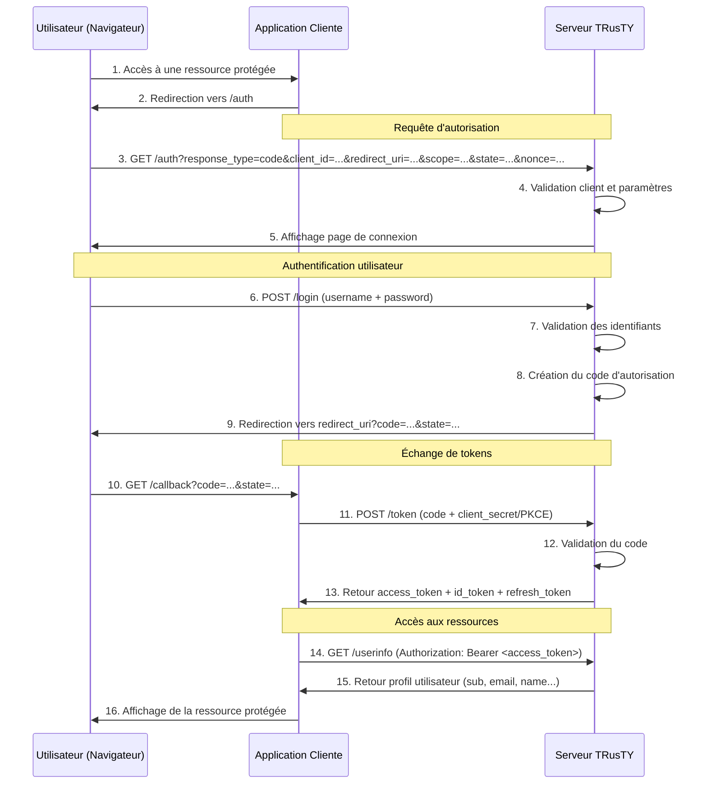
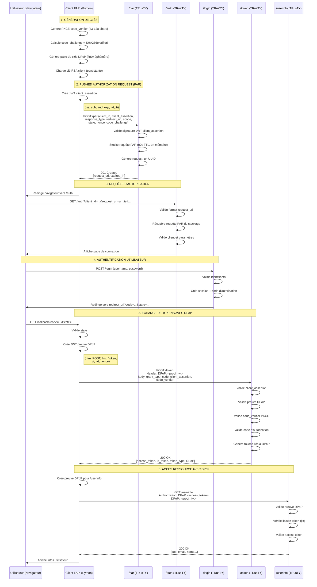
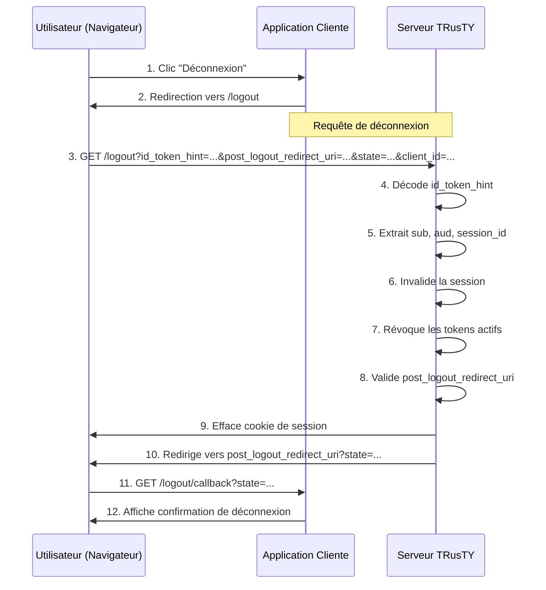

# Flux OIDC & FAPI 2.0 - TRusTY

> **Dernière mise à jour** : 2025-11-30 - Version 0.8.1
> **Conformité aux spécifications** : OpenID Connect Core 1.0 + FAPI 2.0 Security Profile

Ce document décrit les flux d'authentification complets implémentés dans TRusTY, incluant à la fois les flux OIDC standard et FAPI 2.0 (Financial-grade API).

---

## Table des matières

1. [Flux supportés](#flux-supportés)
2. [Flux OIDC standard Authorization Code](#flux-oidc-standard-authorization-code)
3. [Flux FAPI 2.0 avec PAR](#flux-fapi-20-avec-par)
4. [Flux de déconnexion (RP-Initiated)](#flux-de-déconnexion-rp-initiated)
5. [Fonctionnalités de sécurité](#fonctionnalités-de-sécurité)
6. [Points d'accès API](#points-daccès-api)

---

## Flux supportés

TRusTY implémente plusieurs flux d'authentification pour supporter différents niveaux de sécurité :

| Flux | Niveau de sécurité | Cas d'usage | Standards |
|------|-------------------|-------------|-----------|
| **OIDC Standard** | Basique | Applications web | OIDC Core 1.0 + PKCE |
| **FAPI 2.0 avec PAR** | Grade financier | Bancaire, APIs haute sécurité | FAPI 2.0 + PAR + DPoP + private_key_jwt |
| **RP-Initiated Logout** | - | Terminaison de session | OIDC RP-Initiated Logout 1.0 |

---

## Flux OIDC standard Authorization Code

### Diagramme du flux



### Étapes détaillées

#### 1-2. Requête initiale
- L'utilisateur accède à une ressource protégée
- Le client redirige vers le point d'accès d'autorisation

#### 3-4. Requête d'autorisation
**Point d'accès** : `GET /auth`

**Paramètres requis** :
- `response_type=code` (seul le flux Authorization Code est supporté)
- `client_id` - Identifiant de l'application cliente
- `redirect_uri` - URL de callback (doit être pré-enregistrée)
- `scope` - Portées demandées (ex : `openid email profile`)

**Paramètres optionnels** :
- `state` - Token de protection CSRF (recommandé)
- `nonce` - Protection contre la réutilisation pour ID token (recommandé)
- `code_challenge` - Challenge PKCE (méthode S256)
- `code_challenge_method` - Toujours `S256`
- `prompt` - Comportement UI (`none`, `login`, `consent`)
- `max_age` - Âge maximum d'authentification
- `ui_locales` - Langue préférée (`en`, `fr`)

#### 5-6. Authentification de l'utilisateur
- Le serveur affiche la page de connexion (localisée EN/FR)
- L'utilisateur soumet ses identifiants via POST `/login`

#### 7-9. Génération du code d'autorisation
- Le serveur valide les identifiants
- Crée un code d'autorisation à courte durée de vie (TTL 90 secondes)
- Redirige vers le `redirect_uri` du client avec le code

#### 10-13. Échange de tokens
**Point d'accès** : `POST /token`

**Requête** (form-encoded) :
```http
POST /token HTTP/1.1
Content-Type: application/x-www-form-urlencoded

grant_type=authorization_code
&code=<authorization_code>
&redirect_uri=<same_redirect_uri>
&client_id=<client_id>
&client_secret=<client_secret>  // ou PKCE code_verifier
&code_verifier=<pkce_verifier>   // si PKCE utilisé
```

**Réponse** (JSON) :
```json
{
  "access_token": "eyJhbGc...",
  "token_type": "Bearer",
  "expires_in": 3600,
  "id_token": "eyJhbGc...",
  "refresh_token": "refresh_xyz...",
  "scope": "openid email profile"
}
```

**Claims de l'ID Token** (JWT) :
```json
{
  "iss": "https://trusty.example.com",
  "sub": "a1b2c3d4-5678-90ab-cdef-1234567890ab",  // UUID (stable)
  "aud": "demo_client",
  "exp": 1701388800,
  "iat": 1701385200,
  "nonce": "xyz123...",
  "email": "alice@example.com",
  "email_verified": true,
  "name": "Alice Smith"
}
```

#### 14-15. Accès UserInfo
**Point d'accès** : `GET /userinfo`

**Requête** :
```http
GET /userinfo HTTP/1.1
Authorization: Bearer <access_token>
```

**Réponse** (JSON) :
```json
{
  "sub": "a1b2c3d4-5678-90ab-cdef-1234567890ab",
  "email": "alice@example.com",
  "email_verified": true,
  "name": "Alice Smith",
  "preferred_username": "alice"
}
```

---

## Flux FAPI 2.0 avec PAR

### Fonctionnalités de sécurité renforcées

FAPI 2.0 (Financial-grade API) ajoute des mécanismes de sécurité avancés :

| Fonctionnalité | Spécification | Objectif |
|----------------|--------------|----------|
| **PAR** (Pushed Authorization Request) | RFC 9126 | Pré-enregistrer les paramètres d'autorisation côté serveur |
| **PKCE** (S256) | RFC 7636 | Obligatoire - Empêcher l'interception du code |
| **private_key_jwt** | RFC 7523 | Authentification client avec clés asymétriques |
| **DPoP** | RFC 9449 | Liaison de token - Empêcher le vol/réutilisation de tokens |

### Diagramme complet du flux FAPI 2.0



### Étapes détaillées FAPI 2.0

#### 1. Génération de clés

**PKCE** (Proof Key for Code Exchange) :
```python
import base64, hashlib, secrets

# Génère le verifier (43-128 caractères aléatoires)
code_verifier = base64.urlsafe_b64encode(secrets.token_bytes(32)).decode('utf-8').rstrip('=')

# Calcule le challenge (hash SHA-256)
challenge = hashlib.sha256(code_verifier.encode('utf-8')).digest()
code_challenge = base64.urlsafe_b64encode(challenge).decode('utf-8').rstrip('=')
```

**Clés DPoP** (éphémères pour cette session) :
```python
from cryptography.hazmat.primitives.asymmetric import rsa

dpop_private_key = rsa.generate_private_key(
    public_exponent=65537,
    key_size=2048
)
```

**Clés d'authentification client** (persistantes, pré-enregistrées) :
- Clé privée stockée de manière sécurisée
- Clé publique (JWKS) enregistrée avec TRusTY

#### 2. Pushed Authorization Request (PAR)

**Point d'accès** : `POST /par`

**JWT Client Assertion** (signé avec la clé privée du client) :
```json
{
  "iss": "demo_client",
  "sub": "demo_client",
  "aud": "https://trusty.example.com/par",
  "exp": 1701385260,
  "iat": 1701385200,
  "jti": "unique-jwt-id-123"
}
```

**Requête PAR** (form-encoded) :
```http
POST /par HTTP/1.1
Content-Type: application/x-www-form-urlencoded

client_id=demo_client
&client_assertion=eyJhbGc...  # JWT signé avec clé privée client
&client_assertion_type=urn:ietf:params:oauth:client-assertion-type:jwt-bearer
&response_type=code
&redirect_uri=https://client.example.com/callback
&scope=openid+email+profile
&state=xyz123
&nonce=abc456
&code_challenge=E9Melhoa...
&code_challenge_method=S256
```

**Réponse PAR** :
```json
{
  "request_uri": "urn:ietf:params:oauth:request_uri:a1b2c3d4-...",
  "expires_in": 90
}
```

#### 3. Requête d'autorisation avec request_uri

**Requête d'autorisation simplifiée** :
```http
GET /auth?client_id=demo_client&request_uri=urn:ietf:params:oauth:request_uri:a1b2c3d4-... HTTP/1.1
```

Tous les autres paramètres (redirect_uri, scope, PKCE, etc.) sont récupérés depuis la requête PAR stockée côté serveur.

#### 5. Échange de tokens avec DPoP

**JWT Preuve DPoP** (signé avec la clé privée DPoP) :
```json
{
  "typ": "dpop+jwt",
  "alg": "RS256",
  "jwk": {  // Clé publique DPoP
    "kty": "RSA",
    "n": "0vx7agoebGc...",
    "e": "AQAB"
  }
}
// Payload :
{
  "jti": "dpop-proof-123",
  "htm": "POST",
  "htu": "https://trusty.example.com/token",
  "iat": 1701385200,
  "nonce": "server-provided-nonce"  // si requis par le serveur
}
```

**Requête token** :
```http
POST /token HTTP/1.1
Content-Type: application/x-www-form-urlencoded
DPoP: eyJhbGc...  # JWT preuve DPoP

grant_type=authorization_code
&code=authorization_code_123
&redirect_uri=https://client.example.com/callback
&client_id=demo_client
&client_assertion=eyJhbGc...  # Nouveau JWT pour endpoint /token
&client_assertion_type=urn:ietf:params:oauth:client-assertion-type:jwt-bearer
&code_verifier=dBjftJeZ...  # Verifier PKCE
```

**Réponse token** :
```json
{
  "access_token": "eyJhbGc...",
  "token_type": "DPoP",  // Pas "Bearer" !
  "expires_in": 3600,
  "id_token": "eyJhbGc...",
  "refresh_token": "refresh_xyz..."
}
```

**L'Access Token contient** `cnf.jkt` (JWK Thumbprint) :
```json
{
  "iss": "https://trusty.example.com",
  "sub": "a1b2c3d4-...",
  "aud": "demo_client",
  "exp": 1701388800,
  "cnf": {
    "jkt": "0ZcOCORZNYy-DWpqq30j..."  // Empreinte SHA-256 de la clé publique DPoP
  }
}
```

#### 6. Accès UserInfo avec DPoP

**Nouvelle preuve DPoP** pour GET /userinfo :
```json
{
  "jti": "dpop-proof-456",
  "htm": "GET",  // Changé depuis POST
  "htu": "https://trusty.example.com/userinfo",  // Endpoint changé
  "iat": 1701385300,
  "ath": "fUHyO2T1..."  // Hash de l'access token (optionnel)
}
```

**Requête UserInfo** :
```http
GET /userinfo HTTP/1.1
Authorization: DPoP eyJhbGc...  # access_token (pas "Bearer" !)
DPoP: eyJhbGc...  # Nouvelle preuve pour cette requête
```

---

## Flux de déconnexion (RP-Initiated)

### Diagramme de déconnexion RP-Initiated



### Paramètres de requête de déconnexion

**Point d'accès** : `GET /logout`

**Paramètres** :
- `id_token_hint` - ID token reçu lors de la connexion (recommandé)
- `post_logout_redirect_uri` - Où rediriger après déconnexion (doit être pré-enregistré)
- `state` - État à maintenir tout au long du flux de déconnexion
- `client_id` - Identifiant du client (optionnel si dans id_token_hint)
- `ui_locales` - Langue de la page de déconnexion

**Exemple** :
```http
GET /logout?id_token_hint=eyJhbGc...&post_logout_redirect_uri=https://client.example.com/&state=xyz HTTP/1.1
```

---

## Fonctionnalités de sécurité

### Mécanismes de sécurité implémentés

| Fonctionnalité | Standard | Implémentation |
|----------------|----------|----------------|
| **PKCE (S256)** | RFC 7636 | Obligatoire pour tous les flux |
| **Paramètre state** | RFC 6749 | Protection CSRF |
| **Nonce** | OIDC Core | Protection contre la réutilisation d'ID token |
| **private_key_jwt** | RFC 7523 | Authentification client asymétrique |
| **DPoP** | RFC 9449 | Liaison de token (vérification jkt) |
| **PAR** | RFC 9126 | Pré-enregistrement des paramètres d'autorisation |
| **JWT Request Objects** | RFC 9101 | Requêtes d'autorisation signées |
| **Claim sub stable** | OIDC Core | UUID (pas email) |
| **Révocation de token** | RFC 7009 | Invalidation explicite de token |
| **Gestion de session** | - | Suivi de session côté serveur |

### Protection du flux PKCE

```
1. Le client génère code_verifier (chaîne aléatoire)
2. Le client calcule code_challenge = SHA256(code_verifier)
3. Le client envoie code_challenge dans la requête /auth
4. Le serveur stocke code_challenge avec le code d'autorisation
5. Le client envoie code_verifier dans la requête /token
6. Le serveur valide : SHA256(received_verifier) == stored_challenge
7. Si correspondance : émet les tokens. Sinon : rejette avec invalid_grant
```

### Liaison de token DPoP

```
1. Le client génère une paire de clés DPoP éphémère
2. Le client crée une preuve DPoP (JWT signé avec clé privée DPoP)
3. Le serveur valide la signature de la preuve DPoP
4. Le serveur calcule l'empreinte JWK (jkt) de la clé publique DPoP
5. Le serveur embarque jkt dans l'access_token (claim cnf.jkt)
6. Pour chaque requête de ressource :
   a. Le client envoie nouvelle preuve DPoP + access_token
   b. Le serveur valide la signature de la preuve
   c. Le serveur extrait jkt de l'access_token
   d. Le serveur calcule jkt depuis le JWK de la preuve
   e. Si les valeurs jkt correspondent : accorde l'accès. Sinon : rejette 401
```

---

## Points d'accès API

### Discovery & Configuration

| Point d'accès | Méthode | Description |
|---------------|---------|-------------|
| `/.well-known/openid-configuration` | GET | Métadonnées OIDC Discovery |
| `/.well-known/jwks.json` | GET | Clés publiques du serveur (JWKS) |

### Points d'accès OIDC Core

| Point d'accès | Méthode | Description | Auth requise |
|---------------|---------|-------------|--------------|
| `/auth` | GET | Point d'accès d'autorisation | Non |
| `/login` | GET/POST | Page d'authentification utilisateur | Non |
| `/token` | POST | Échange de tokens | Auth client |
| `/userinfo` | GET | Profil utilisateur | Access token |
| `/logout` | GET | Déconnexion RP-initiated | Non |
| `/revoke` | POST | Révocation de token | Auth client |

### Points d'accès FAPI 2.0

| Point d'accès | Méthode | Description | Auth requise |
|---------------|---------|-------------|--------------|
| `/par` | POST | Pushed Authorization Request | Auth client (private_key_jwt) |
| `/introspect` | POST | Introspection de token | Auth client |

### Points d'accès utilitaires

| Point d'accès | Méthode | Description |
|---------------|---------|-------------|
| `/health` | GET | Vérification de santé |
| `/observability/sessions` | GET | Nombre de sessions actives |
| `/observability/tokens` | GET | Statistiques des tokens |

---

## Exigences de configuration client

### Client OIDC Standard

```yaml
client:
  client_id: "demo_client"
  client_secret: "demo_secret"
  redirect_uris:
    - "http://localhost:5001/auth/callback"
  post_logout_redirect_uris:
    - "http://localhost:5001/"
  token_endpoint_auth_method: "client_secret_post"  # ou client_secret_basic
  grant_types:
    - "authorization_code"
  response_types:
    - "code"
  scope: "openid email profile"
```

### Client FAPI 2.0

```yaml
client:
  client_id: "fapi_client"
  # Pas de client_secret ! Utilise private_key_jwt
  redirect_uris:
    - "http://localhost:5002/auth/callback"
  post_logout_redirect_uris:
    - "http://localhost:5002/"
  token_endpoint_auth_method: "private_key_jwt"
  jwks:  # Clé publique client pour vérification de signature
    keys:
      - kty: "RSA"
        use: "sig"
        kid: "fapi-client-key-1"
        n: "0vx7agoebGc..."
        e: "AQAB"
  grant_types:
    - "authorization_code"
  response_types:
    - "code"
  scope: "openid email profile"
  require_pushed_authorization_requests: true  # PAR obligatoire
```

---

## Gestion des erreurs

### Réponses d'erreur courantes

**Erreurs d'autorisation** (redirection vers redirect_uri) :
```http
HTTP/1.1 302 Found
Location: https://client.example.com/callback?error=invalid_request&error_description=Missing+nonce+parameter&state=xyz
```

**Erreurs du point d'accès token** (réponse JSON) :
```json
{
  "error": "invalid_grant",
  "error_description": "Authorization code has expired or already been used"
}
```

**Erreurs UserInfo** :
```json
{
  "error": "invalid_token",
  "error_description": "Access token is expired or invalid"
}
```

### Codes d'erreur

| Code d'erreur | Description |
|---------------|-------------|
| `invalid_request` | Paramètres manquants ou invalides |
| `unauthorized_client` | Client non autorisé pour cette opération |
| `access_denied` | Utilisateur a refusé l'autorisation |
| `unsupported_response_type` | Type de réponse non supporté |
| `invalid_scope` | Portée demandée invalide |
| `server_error` | Erreur interne du serveur |
| `invalid_client` | Échec d'authentification client |
| `invalid_grant` | Code d'autorisation/refresh token invalide |
| `unsupported_grant_type` | Type de grant non supporté |
| `invalid_dpop_proof` | Échec de validation de la preuve DPoP |

---

## Références

### Spécifications OpenID Connect
- [OIDC Core 1.0](https://openid.net/specs/openid-connect-core-1_0.html) - Spécification principale
- [OIDC Discovery 1.0](https://openid.net/specs/openid-connect-discovery-1_0.html) - Mécanisme de découverte
- [OIDC RP-Initiated Logout 1.0](https://openid.net/specs/openid-connect-rpinitiated-1_0.html) - Flux de déconnexion

### Spécifications FAPI 2.0
- [FAPI 2.0 Security Profile](https://openid.bitbucket.io/fapi/fapi-2_0-security-profile.html) - Spécification principale

### RFCs OAuth 2.0
- [RFC 6749](https://datatracker.ietf.org/doc/html/rfc6749) - Framework OAuth 2.0
- [RFC 7636](https://datatracker.ietf.org/doc/html/rfc7636) - PKCE
- [RFC 7009](https://datatracker.ietf.org/doc/html/rfc7009) - Révocation de token
- [RFC 7523](https://datatracker.ietf.org/doc/html/rfc7523) - Authentification client JWT
- [RFC 9126](https://datatracker.ietf.org/doc/html/rfc9126) - PAR (Pushed Authorization Requests)
- [RFC 9101](https://datatracker.ietf.org/doc/html/rfc9101) - JWT Secured Authorization Request (JAR)
- [RFC 9449](https://datatracker.ietf.org/doc/html/rfc9449) - DPoP (Demonstrating Proof of Possession)

---

**Version du document** : 2.0
**Statut** : Prêt pour production
**Dernière révision** : 2025-11-30
